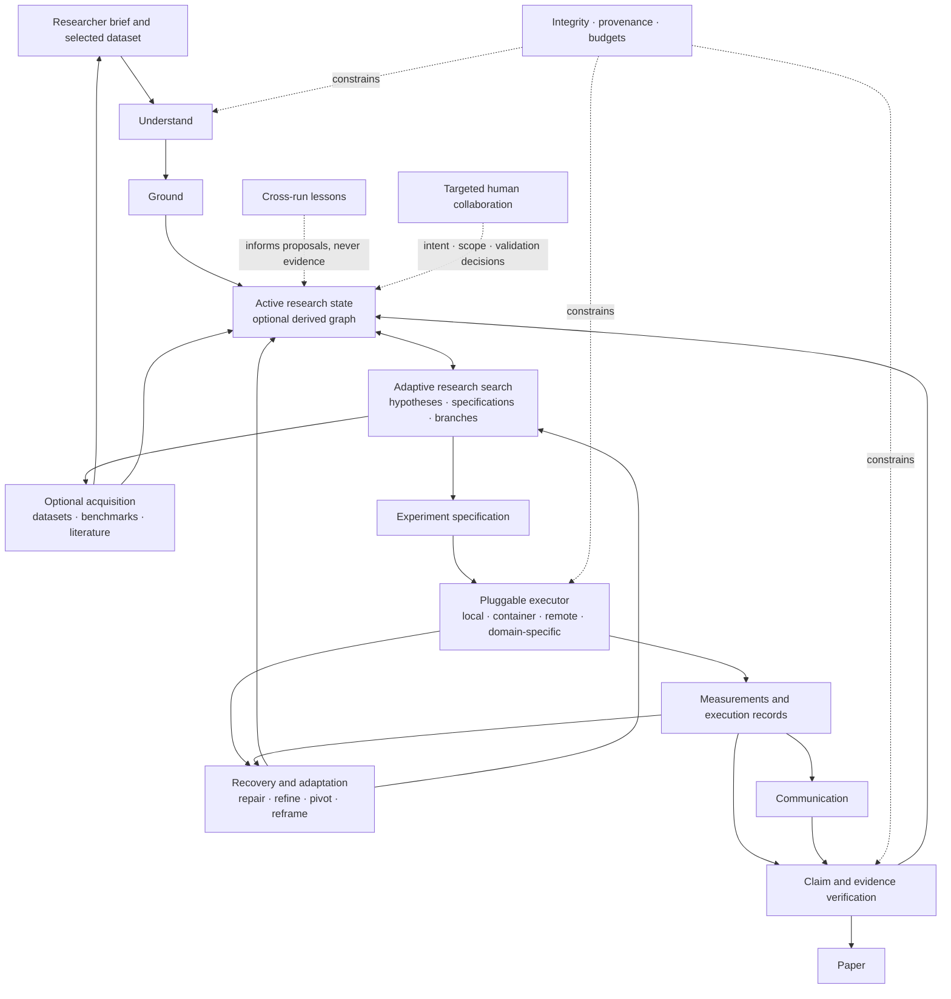

# Popper Architecture

Target architecture for Popper, an AI scientist for quantitative tabular research. This document defines vision, boundaries, responsibilities, contracts, invariants, state and evidence semantics, dependency rules, major flows, and architectural decisions. [ROADMAP.md](ROADMAP.md) describes product outcomes and capability sequencing. File changes, migrations, test cases, and task ordering are implementation details documented separately when needed.

The design distinguishes capabilities already present from target commitments where that distinction affects a contract. It does not prescribe implementation order. Optional orchestration strategies, including the earlier [graph-based diagram](images/architecture.svg), do not define the core architecture.

## 1. Scope

- **Input:** a research context (a narrative brief with optional structured front matter: domain, objectives, variable meanings and roles, design, constraints; §4.1) and one tabular dataset. **Output:** a run folder with a LaTeX paper, a claims file, and every attempt, execution and decision that produced them.
- **In scope:** understanding the research problem with the researcher, grounding it in the data (preparation and assessment), exploration, hypothesis generation, analysis by generated code, write-up, review, optional verification on held-back rows.
- **Out of scope:** automatic procurement or collection of new data, multiple datasets in one run, non-tabular data, shared multi-user deployment. Optional acquisition may locate and assess candidate inputs; researcher selection and a single tabular dataset remain the boundary of a run.
- **Quality attributes, in priority order:**
  1. _Scientific usefulness_: find relevant, testable hypotheses and findings with enough sourced evidence and explicit uncertainty to justify further testing. Investigate alternatives, accumulate knowledge, and choose discriminating follow-ups; candidate count and favorable estimates alone are not useful discovery.
  2. _Recoverability_: learn from execution and scientific obstacles, preserve committed history, and continue justified research. Reproduce an execution where its environment permits; exact numerical reproduction is not guaranteed.
  3. _Traceability_: every empirical claim resolves to its measurement, execution and sources; execution alone does not establish scientific validity.
  4. _Honest labelling_: deterministic status and rule-based outcomes are computed from declared contracts; scientific assessments remain attributed and qualified.
  5. _Simplicity_: the smallest mechanism that meets these outcomes. Configurable LLM budgets govern resource allocation; a small default budget does not define the capability boundary.

### Design overview



The diagram shows capabilities and information flow, not required agent topology or build sequence. Committed records are authoritative; working views and any derived graph support research decisions. Adaptive research search is a core capability; trees, tournaments, agent roles, and executor backends are replaceable strategies. Acquisition can supply resolved literature before framing and during discovery; candidate datasets still pass researcher selection and Ground.

These capabilities extend Popper's artifact-backed, evidence-qualified research loop; they do not replace its scientific identity, integrity, or researcher-intent commitments.

Mechanisms from AIDE, AI Scientist-v2, Co-Scientist, Kosmos, and ARC motivate these responsibilities [1, 3, 4, 8, 32]. Their results support adaptation, not a claim that the combined Popper design has already been validated:

- **Adaptive research search** manages hypothesis and specification candidates, branch selection, follow-ups, and resource allocation with retained lineage and exposure (§4.6). It reuses code search within each experiment rather than treating code optimization as the whole research process.
- **Active research state** makes findings, failures, contradictions, unresolved questions, and next opportunities available through sourced working views (§4.6, §9).
- **Recovery and adaptation** diagnoses observations and proposes bounded repair, refinement, pivot, or reframe transitions with identity and provenance (§4.6).
- **Evidence and claim verification** traces claims, numbers, and figures to measurements, executions, code, inputs, and assumptions; this audit does not itself establish scientific validity or validation standing (§4.7, §10, §11).
- **Pluggable execution** runs a committed experiment specification against declared inputs through a backend contract. Local, container, remote, and domain-specific executors must preserve the same identity, access, logging, and result contracts (§5, §7.4).
- **Acquisition** is an optional upstream capability that finds and assesses candidate datasets, benchmarks, and literature with source provenance and limitations. It may inform research framing; it does not silently make an acquired source eligible evidence (§4.1, §11, §12).
- **Cross-run learning** may turn prior failures, repairs, and recurring patterns into attributed lessons or reusable skills. Such lessons can inform proposals, but are not observations or evidence for a new run (§9).
- **Targeted human collaboration** asks for input when a decision can change intent, scope, operationalization, or a validation commitment. Routine execution and same-specification repair remain bounded autonomous work (§7.8).

## 2. Principles

The core vision is a scientist that finds useful, evidence-grounded candidates for further testing through repeated attempts, observations and adaptation. Integrity safeguards this discovery process and its evidence standing. Architectural completeness is not a prerequisite for useful exploration. These are commitments; §2.2 lists replaceable strategies; the hard invariants in §2.1 apply regardless of quality-attribute priority.

1. **Useful discovery first.** Every increment preserves a runnable end-to-end path and improves the researcher's ability to find, test, understand or pursue a scientifically useful result. A candidate should state its question, rationale, evidence, uncertainty and a discriminating next test. Negative or inconclusive studies can close unproductive directions or motivate useful follow-ups.
2. **Active research state.** Keep what is known, attempted, failed, hypothesized and unresolved across sessions, and expose it for candidate generation and next-action selection (§4.6). Working views and any derived graph resolve to committed records.
3. **Adaptive research search.** Use `attempt → execute → observe → diagnose → next move`, with candidate hypotheses, specification branches, recovery, follow-ups, bounded transitions and explicit stopping. Never retry until a result looks favorable. Sequential and parallel execution obey the same identity and evidence contracts.
4. **Scientific identity and adaptation provenance.** Distinguish question, hypothesis, intended test, specification version, code and execution. Record the trigger, reason and changes (§4.6). Scientific changes cannot hide inside technical debugging.
5. **Separate evidence dimensions.** Provenance identifies an observation's sources; measurement fidelity checks the intended test; scientific validity concerns the inference (§4.7). Fresh execution does not establish all three.
6. **Independent challenge.** Separate generation from challenge. A fresh context can be sufficient to start; Critic and debate are strategies (§6). Challenge remains an attributed assessment, not independent empirical validation.
7. **Adaptive discovery, locked validation.** Discovery can learn from failures and results. Final validation uses a locked protocol and suitable unexposed evidence independent of adaptive selection under its stated design; discovery cannot assign its own validation standing (§11). This is a chosen conservative product boundary, not a claim that sample splitting is the only valid statistical approach [17, 26, 27].
8. **Integrity stays hard.** Record every execution, preserve write-once artifacts, enforce access/sealed-data boundaries, compute labels in code and render paper numbers from committed named results. Scientific advice ordinarily supplies feedback rather than preventing an attempt. Protect researcher-confirmed intent explicitly.
9. **One source and owner.** Reuse phase artifacts, journal and run store; no parallel research-memory authority. Phases diagnose evidence, propose transitions and own scientific semantics. Harness validates artifact contracts, identity and integrity. Coordinator authorizes bounded routes and executes cross-phase transitions; it does not duplicate phase-level scientific policy.
10. **Adapt established mechanisms.** Use primary papers and implementations to identify useful search, state, recovery, acquisition and learning mechanisms [1, 3, 4, 8, 32]. Adapt them to Popper's contracts before inventing replacements. Local benchmarking is not an adoption prerequisite during development; contract checks establish operational behavior, and later evaluation measures scientific usefulness and transfer.
11. **Simplicity and directness.** Prefer one authoritative path for each responsibility. Correct or retire restrictive and opaque paths instead of layering workarounds over them. Preserve integrity and the meaning of existing evidence; unmeasured preferences alone do not justify a wholesale redesign.
12. **Harness quality is part of scientific capability.** Explicit artifact contracts, checkpoints, bounded recovery, environment diagnosis, deterministic integrity checks and targeted human escalation matter alongside agent reasoning [32]. Compose them from current mechanisms before adding agents, services or infrastructure. Graceful degradation preserves useful output with honest standing.

### 2.1 Invariants

These baseline protections are implemented. Target commitments below the table become executable checks as their capabilities ship; they are not a claim that future capability exists today.

| Baseline invariant | Enforced by |
| --- | --- |
| Every model call, tool call, execution and decision is journaled | Harness (§7.5) |
| Run files are write-once; a fix is a new node, attempt or assessment | Run store (§9) |
| Accepted evidence comes from a fresh execution of the submitted script | Search engine and Ground submit (§4.3, §5.1) |
| Evidence labels are computed from declared rules | Search and publication responsibilities (§5.5, §10) |
| Paper numbers resolve to named results; unknown names are flagged | Renderer (§10) |
| Research context, answers, dataset strings, outputs and retrieved text are untrusted data | Context assembly (§7.3) |
| No credentials in run files or script environments | Sandbox and run store (§7.4, §7.5) |
| Holdout rows never reach discovery nodes, sessions or tools | Run store at ingest (§11) |
| Code-supplied initial framing data omit computed between-column relations and holdout rows | Understand inputs (§4.1); researcher text and later Ground feedback may describe relations |
| Only researcher input confirms research-context metadata | Research-context schema (§4.1) |
| Descriptive statistics are computed by code | Initial data analysis (§4.2) |
| Dependency rules of §3 hold | Production components obey the dependency contract |

**Target invariants:** accepted artifacts satisfy declared read/write contracts and cite their producer/input versions; state entries and transitions cite committed sources; repairs preserve declared scientific identity; specification changes create versions; corrected measurements do not erase prior ones; validation authority cannot be exercised by the adaptive discovery loop. Prediction verdicts and validation labels are computed once their evidence/protocol contracts exist. Research-context metadata status `confirmed` means researcher-approved metadata, not empirical truth or validation support. These are integrity/product commitments; they do not make assumption truth or scientific validity mechanically decidable.

**Warnings versus boundaries.** Role/type conflicts, temporal-order concerns, few clusters, weak operationalization and unconfirmed assumptions supply scientific feedback and printed limitations. Access prohibitions, credentials, fabricated/missing evidence, sealed data and unauthorized edits of researcher-confirmed intent are integrity boundaries. A protected/excluded-column warning is not a substitute for enforcing an explicit access restriction. Future method or robustness advice does not automatically become a code gate (§4.4–4.5).

### 2.2 Replaceable strategies

| Strategy | Current position | Reason to extend or change |
| --- | --- | --- |
| Sequential coordinator playbook | Baseline routing strategy | Adopt richer orchestration only when fixed routing blocks a needed capability |
| Draft/debug/improve trees | Implemented within Discover; reuse | Compare completion, fidelity, selection and cost with bounded linear scheduling |
| Research Graph | Optional future state/lineage representation | Committed records become difficult to query or explain; no second authority |
| Fresh-context challenge, Critic, debate | Separate Judge context today; scientific challenge later | External evidence or observed self-confirmation supports adoption; local comparisons refine defaults |
| Discover or PI agent | Optional orchestration of the same contracts | Fixed routing limits useful discovery/recovery |
| Parallel branches, tournaments, hierarchical planners | Target search strategies; topology is replaceable | Existing systems motivate wider search and challenge; concurrency preserves branch ownership, checkpoints and exposure |
| Judge blinding, method/robustness schedules | Implemented policies, open to refinement | Reduce selection bias while retaining necessary diagnostic information |

Strategies do not substitute for core commitments. Added complexity must buy end-to-end value; local ablation can follow implementation rather than block it.

## 3. Components and dependencies

| Subsystem       | Package                                                          | Owns                                                                                                             | Section    |
| --------------- | ---------------------------------------------------------------- | ---------------------------------------------------------------------------------------------------------------- | ---------- |
| Coordinator     | `coordinator/`                                                   | Phase order, scheduling selected moves, global budget limits, bounded transitions, run status and sourced research-state view; no scientific ranking policy | §4 |
| Research phases | `understand/`, `ground/`, `discover/`, `communicate/`, `verify/` | Stage goals, role prompts, phase outputs and phase-owned scientific specifications, feedback and evidence semantics                                                                         | §4, §10–12 |
| Search engine   | `treesearch/`                                                    | Nodes, step policy, node evaluation, selection, the Analyst's tools                                              | §5         |
| Adaptive research search | `discover/` | ResearchMove contract, candidate generation and scientific next-move policy; replaceable BudgetAllocator strategy | §4.6 |
| Harness         | `harness/`                                                       | Model client, agent loop, tools mechanism, context, sandbox, journal, run store, budgets, config, decision layer, research-context schema, role-free descriptive statistics | §4.1, §4.2, §7, §8 |
| Execution boundary | Harness contract; replaceable backends | Runs committed experiment specifications while preserving identity, access controls, provenance, and result semantics | §5, §7.4 |
| Acquisition (optional) | External source boundary | Finds and assesses candidate datasets, benchmarks, and literature; returns sourced candidates for researcher/context use | §4.1, §11, §12 |
| Evidence and claim verification | Research phases and publication | Checks claim, number, and figure lineage against committed measurements and executions; distinct from locked statistical validation | §4.7, §10, §11 |
| Cross-run learning (optional) | Sourced lesson store | Produces attributed lessons or reusable skills from prior run patterns; lessons inform proposals but never count as evidence | §9 |
| Human collaboration | Coordinator, phases, harness | Escalates only decisions that can materially change intent, scope, operationalization, or validation commitment | §7.8 |
| Evaluation      | Evaluation subsystem                                              | Suites, metrics, comparisons, adoption records                                                                   | —          |

```text
cli ──► coordinator ──► understand · ground · discover · communicate · (verify)
                               │
                               ▼
                           treesearch ──► harness
```

Dependency rules:

- `harness` imports nothing else in Popper and holds no research logic.
- `treesearch` imports only `harness`; it knows no stage goals.
- Phase packages import only `harness` and `treesearch`, never each other.
- Only `coordinator` knows cross-phase routing. Its research-state view references phase-owned records rather than duplicating scientific logic or mutable memory. `verify/` is a future package.
- Evaluation may depend on production components; production components never depend on evaluation.
- These rules are an import contract checked in CI, not a convention [30].
- Prompts and model configuration belong to the harness and the phase that owns the relevant interaction. Configuration can be overridden without changing phase ownership or architectural contracts.

Acquisition and execution backends sit behind source and executor contracts; they do not introduce research logic into the harness. Cross-run lessons are advisory context, not measurements or validation evidence. A claim audit checks traceability and report fidelity; locked validation evaluates a claim under an independent statistical protocol (§11).

## 4. Run lifecycle

The principal flow moves from researcher framing through data grounding, exploration, analysis, and communication. Optional validation follows discovery under a separate authority.

### 4.0 Current-path reconciliation

The implemented M0–M2-optimize path is `cli.main(run/resume) → coordinator.run/resume → _continue`: create or load a format-4 run and acquire its lock; parse the research context and compute raw descriptive statistics; Understand writes a frame, pauses for review when interactive, and resumes from the reviewed artifact; Ground prepares data and may route a bounded frame concern back to Understand; the coordinator promotes the final prepared data; Discover runs `explore`, proposes and commits one hypothesis, then runs `baseline → main → robustness`; Communication resolves named results from `results.json`, renders the paper, and commits the report. Each search stage owns a journaled `tree/<stage>/` of draft/debug/improve nodes. Resume rebuilds incomplete stages from node and stage events, while committed phase artifacts and output files remain write-once.

| Existing mechanism and owner | Disposition for the M0–M2 path | M3 boundary |
| --- | --- | --- |
| CLI, coordinator phase order, frame review, Ground preparation/reframe | Keep | Keep the upstream path; replace only the single-pass Discover block with the ResearchMove loop. |
| RunStore format 4, append-only journal, artifact hashes, resume lock, spend accounting and sealed holdout | Keep | New candidate work must cite the same committed sources and share exposure. Preserve the format-4 reader and its refusal of unsupported legacy runs; introduce an explicit format change only if new persisted contracts require it. |
| `treesearch.run_stage` draft/debug/improve, deterministic replay and Judge node scores | Keep as the inner search over analysis scripts | Keep stage scores local to code execution quality. Add candidate and next-move selection at the Discover boundary; never interpret node scores as hypothesis quality or evidence standing. |
| Single `HypothesisProposal`, hard-coded `hypothesis-001`, closed `Method` literal, and `_continue`'s one-hypothesis route | Adapt in the owning Discover/coordinator path | Generate stable candidate identities, support extensible `MethodSpec`, and iterate the same research loop. Read old format-4 hypothesis payloads under their existing semantics; do not run a parallel old and new pipeline. |
| Global `baseline`, `main`, `robustness`, `robustness_plan`, and `evidence` identities | Adapt before executing multiple candidates | Scope new attempts, plans and evidence to hypothesis/specification identity so retries and resume cannot reuse another candidate's artifacts. Keep old unscoped format-4 artifacts readable and unchanged. |
| Fixed baseline/main/robustness analysis and computed legacy stability label | Keep for current runs; adapt as an inner per-candidate test policy | Preserve each old label's original rule and report. New candidate selection records all branches; a legacy stability score is not the outer search objective. |
| `communicate.numbers`, manifest-backed evidence references and compiled paper | Keep | Continue rendering values from committed results. Extend publication to selected candidates and lineage without letting prose or Judge scores create results. |

No current mechanism needs wholesale replacement or deletion to establish M3. The restriction to one hypothesis and the closed method schema conflict with M3's expanded contract and therefore require targeted adaptation; the rest remain useful foundations. Remove a mechanism only if the traced caller and persisted-state scan show it has no remaining role after that adaptation.

| # | Phase | Package | Current contract | Output |
| --- | --- | --- | --- | --- |
| 1 | Understand | `understand/` | Theorist session: research context and initial data analysis → reviewed Research Frame (§4.1) | Research Frame |
| 2 | Ground | `ground/` | Data Steward prepares/assesses data; frame concerns return to 1 within the existing limit (§4.3) | Prepared data, changes, operationalization, concerns, readiness |
| 3 | Exploration & hypothesis | `discover/` | Exploration and generation of a sourced hypothesis with warnings | Hypothesis |
| 4 | Experiment | `discover/` | Baseline analysis, planned alternatives, repair, and explicit evidence standing | Attempts, estimates, figures, evidence standings |
| 5 | Publication | `communicate/` | Template paper from artifacts and named results; extensions in §10 | Paper and run trace |
| — | Verify (future, optional) | `verify/` | Locked independent validation (§11) | Verification record |

- **Current hypothesis contract** [6, 22]: one primary estimand (outcome, exposure, contrast, population, unit), expected direction, a refuting result, planned test, assumptions, source nodes and attribution. Its current method/reference identifiers are not a complete frozen scientific specification; §4.6 makes that identity explicit.
- **Later extensions:** rival explanations, origin and test-data exposure, structured predictions/verdicts, pre-test sample description, optional smallest effect of interest, typed rival checks and auxiliary predictions. None requires graph nodes. A secondary estimand or changed target population is its own test, not automatically a robustness replicate.
- Phases exchange files/references and never edit another phase's output. Revisits create new attempts with reason and lineage.
- The coordinator owns phase order and bounds cross-phase transitions. The target discovery loop selects among hypotheses and specifications and can schedule independent branches concurrently. A revisit or branch preserves prior attempts, scientific identity, selection history and exposure (§4.6).
- Operational run status is separate from scientific outcome. Negative evidence is not a failed execution.

### 4.1 Research context and Understand

**Research context** is the researcher's input besides the dataset: a narrative brief with optional structured metadata. It supplies the goals, domain, variable meanings, design, assumptions, and constraints that phases interpret and carry forward [3, 5, 33, 34].

- Research context covers domain, objectives, variable meanings and roles, study design, assumptions, constraints, and concepts. Ground owns the mapping from concepts to observed data.
- Researcher-confirmed metadata is distinct from agent-proposed and unknown information. Only researcher input confirms intent; models and downstream checks preserve that distinction and expose relevant uncertainty in the report.
- Guidance can shape an agent's interpretation, but cannot change deterministic integrity checks or computed labels.
- The harness validates supplied metadata against the dataset and treats all researcher-provided text as untrusted data (§7.3).

**Understand** turns the research context into a **Research Frame**: shared research meaning the researcher can recognize and correct. It is one Theorist session (§6) that sees the research context and role-free initial data analysis of discovery rows, without code-supplied empirical between-column relations or holdout rows [34]. Researcher text and later Ground concerns may mention relations; this input policy is not a guarantee of total non-exposure.

- **Explore, critique, synthesize.** The agent chooses its own order and may repeat: restate and widen the problem, sharpen questions, find ambiguities, implicit assumptions and competing explanations, propose meaning, unit, type, role and order for undeclared attributes with evidence; critique its own framing (what is missing, alternative framings, the weakest assumption); then submit.
- **Researcher input and frame submission** allow questions, proposed or unknown metadata, and a structured framing with objectives, scope, uncertainties, and directions. Code checks schema and evidence, refuses changes to confirmed intent, and returns correctable failures to the agent (§7.1). Framing does not redefine metadata owned by the research context.
- **Review.** The researcher can confirm, revise, reject, or leave proposals unresolved. Only researcher input confirms intent. Automated runs preserve proposals as unconfirmed. A revision produces a new sourced framing attempt rather than silently changing confirmed metadata.
- **Computed framing warnings:** a question whose outcome candidate has role `id`, `cluster`, `post_outcome`, `protected` or `ignore`, a question needing an excluded column, duplicate directions.

The reviewed research context is the single source for what variables and concepts mean; the framing holds only agent output. Later phases read it: Ground takes concepts, valid ranges, codings and excluded columns; `explore` and the hypothesis take objectives, directions, roles, confounders and the foundation (§4.3); experiments take design and clusters (§4.5); the Writer takes domain, audience, objectives and the assumption list. Revising it after Ground or after results writes a new attempt with a journaled reason, as a scientist refines a research goal in [3].

**Optional acquisition.** A source-acquisition capability may identify candidate datasets, benchmarks, and literature relevant to the research context. It returns source identity, retrieval provenance, suitability signals, and known limitations for researcher or phase review. It does not silently replace researcher intent, bypass Ground, or grant a source empirical standing. A run still uses one selected tabular dataset.

### 4.2 Initial data analysis

**Current foundation.** Descriptive statistics are computed by code, not a model [33, 34]. One harness module backs the ingest profile and data inspection/summary, before and after accepted preparation. It preserves named numerical artifacts and layouts; phase packages own scientific interpretation. The framing view contains no outcome–exposure relations.

Current primitives cover structure (rows, columns, duplicates and keys), quality (missingness, codings/ranges and unusual values), univariate distributions (location, spread, shape, quantiles and levels) and design descriptors (cluster/time structure where available). A statistic needs data/metadata support; missing or undefined measures stay explicit rather than invented.

Further descriptive evidence such as sample flow, characteristics, covariate balance, and design-based precision can help audit intended tests. Compute such evidence in its owning phase without duplicating descriptive logic. Sample characteristics and balance do not require significance tests [24]; a proposed threshold such as 0.1 standardized mean difference is a convention, not a universal scientific gate. Precision or an `underpowered` label needs an explicitly stated magnitude and design. Pre-test descriptions carry timing and exposure, especially when their rows are later called confirmatory or validation data (§11).

### 4.3 Ground

**Ground** connects the Research Frame to what the data actually observe and produces an **empirical foundation**: what the data measure, how far they can be trusted, how each concept is represented, what is missing, and whether discovery can start. It is one Data Steward session (§6) on discovery raw rows; there is no tree and no Judge.

- **Responsibilities**, in the order the agent chooses: understand (semantics, observation unit, structure, provenance, which columns or proxies measure each concept), repair (cleaning, restructuring, transformation, derived variables), interrogate (anomalies, distributions, missingness by group, figures), assess (what the data cannot support). Enrichment from other sources is out of scope (§1).
- **Ground submissions** combine a preparation proposal with an operationalization of concepts and evidence-backed concerns. The harness executes the proposed preparation freshly and checks declared data invariants and evidence references before accepting its outputs.
- **After acceptance** code writes initial data analysis on the prepared data and **readiness facts**: each outcome and exposure exists and varies, its missing share, cluster count, floor and ceiling share. Readiness is printed, never blocking.
- **Operationalization is a proposal.** It stays `proposed`; Discover reads it as such, and the paper prints it as proposed by the data agent.
- **Frame concerns go back.** Ground never edits the research context. A material framing concern may open a researcher-visible revision and a new Ground attempt from the original data; unresolved concerns remain visible in the report.
- **Forbidden to use, not forbidden to see.** The Steward needs the outcome to prepare data, so it may see outcome–exposure relations. Preparation decisions must not be justified by the relation they produce [16]. Record the reason for each change and disclose raw-data access in the report.

### 4.4 Hypothesis quality

**Current contract.** Code requires one primary estimand with distinct named outcome/exposure columns, a contrast, comparison (`difference` or `ratio`), population and unit; statement/rationale, expected direction, refuting result, planned test and a nonempty list from the current closed method vocabulary. These schema checks protect executable meaning; the closed vocabulary is a baseline implementation restriction, not a commitment that only these scientific methods are legitimate. The target `MethodSpec` is extensible (§4.5).

**Ownership.** Discover owns hypothesis generation, its contract, scientific warnings and the cross-phase scientific next-move policy. Understand owns framing. The coordinator schedules selected moves, enforces run-wide resource limits and routes committed outputs; it does not rank scientific candidates or revise move intent. The harness enforces integrity and artifact contracts, not scientific policy.

**Current feedback.** Nonblocking warnings identify unusable roles/types, exposure measured after outcome, excluded/protected columns, missing/proposed variable meaning, weak/absent proxies, unconfirmed/undeclared assumptions and few clusters. They are stored beside the hypothesis and printed in the paper. An explicit access restriction remains a separate hard boundary (§2.1).

Further hypothesis quality mechanisms can record rivals, origin, structured predictions, pre-test support, and an optional effect-size threshold. Independent challenge checks relevance, assumptions and discriminating tests (§6); no mandatory Critic rubric. A low-precision or underpowered label requires a defensible magnitude/design contract, not a blanket reason to block exploratory work. Method-fit advice starts as feedback. Any scientific gate must name the concrete failure it prevents and why permitting an attempt would be inappropriate; external evidence can justify adoption and local evaluation refines scope.

### 4.5 Analysis methods

**Current reality.** The current method vocabulary is a baseline implementation restriction, not a claim that only listed scientific methods are legitimate. Method declarations require an explicit scientific specification and visible assessment standing; accepting a declaration does not certify its validity.

**Open `MethodSpec`.** Before expanding multi-hypothesis search, represent a method as a structured but extensible declaration: method family or `custom`, description/implementation reference, intended inputs and outputs, estimand/effect scale where applicable, assumptions and diagnostics. Known methods may use typed fields and reusable implementations; custom or generated methods state the same contract and undergo the same code, execution, fidelity and evidence checks. Unknown vocabulary alone does not make a method ineligible. A declaration enables an attempt; it does not certify suitability or validity.

Method-fit feedback uses outcome/exposure type, design, population, contrast, effect scale and inference assumptions. A categorical mismatch or diagnostic is evidence to diagnose or try a justified alternative, not an automatic scientific prohibition.

Useful extensions include sample support, balance, few-cluster inference advice, bounded/count-outcome methods and diagnostic-triggered variants [34, 24, 25]. Record when/why a diagnostic was used; it cannot silently alter the primary method inside a repair. A changed planned test is refinement. Thresholds and any enforced method policy require an explicit scope/rationale; avoid a universal rule that cluster fixed effects solves all few-cluster inference, or that normality tests should choose the estimator. Build supported remedies for observed failures, then refine their defaults locally rather than await a complete method benchmark.

### 4.6 Research state and scientific feedback

**Current reality.** Discover runs exploration, one hypothesis and three experiment stages. Local debugging, fresh execution, robustness schedules, evidence manifests and journal provide foundations for state and feedback, but do not yet provide a general scientific transition model.

**Research state.** An artifact-backed view keeps question/scope and confirmed intent; hypothesis/specification versions; attempts and executions; observations/evidence; failures/diagnoses; attributed interpretations, contradictions and open questions; exposure and budget allocations. Distinguish facts, proposals and assessments, and unresolved questions from answers. Every entry cites sources. Rebuild the view from committed phase records/events on resume, without a second mutable memory authority or mandatory Research Graph. Start with the state required to run a small adaptive loop; extend it when a research move needs information the current view cannot supply.

**Working representation.** Agents can query what has been tried, which findings remain usable, which assessments conflict, which questions remain open, and which candidates are eligible for further work. Proposed opportunities cite their motivating records and remain proposals until selected. A derived Research Graph may index these relations; its entries and summaries are rebuildable projections. Parallel sessions receive a recorded state version, and their outputs identify the inputs they actually read.

**Scientific next-move ownership.** `discover/` owns one scientific next-move policy across phases. It reads the sourced research state, consumes phase-owned diagnoses and proposes a `ResearchMove`; phases retain authority over diagnosis and the meaning of their artifacts. The coordinator schedules the selected move and enforces run-wide limits. The harness checks access, identity, artifact and execution integrity. Neither coordinator nor harness duplicates or overrides scientific ranking policy.

**ResearchMove contract.** Every proposed scientific move records: objective; evidence trigger and source references; candidate action and affected or proposed hypothesis/specification when applicable; expected discriminating value (what possible observation would distinguish); estimated resource cost; and stopping condition. It also records assumptions, provenance/exposure, and whether the move is exploratory, technical repair, measurement repair, refinement, pivot, reframe, acquisition or stop. Reject incomplete proposals with actionable feedback; retain the proposal and disposition. A move is a proposal until the coordinator schedules it under run-wide limits; scheduling does not change its scientific meaning.

**Budget allocation.** A replaceable `BudgetAllocator` strategy owned by adaptive search recommends allocate, continue, pause, stop or reallocate for eligible candidates under the run's configured limits. It considers expected discrimination, unresolved uncertainty, relevance, feasibility, diversity and estimated cost. It may not optimize significance, favorable direction or agreement with prior expectations. Record allocation, rationale, observations and displaced alternatives. The coordinator applies the global caps and schedules the recommendation; it does not invent scientific value scores. Reallocation preserves prior spend, work and exposure.

**Scientific identity.** Distinguish question, hypothesis, intended test/specification version, measurement implementation/code revision and execution. Record the primary estimand, effect scale/null, population/data selection, estimator/inference and adjustment choices needed to detect scientific changes. Existing operations and opaque Judge references are inputs to this refactor, not proof of a frozen specification. Each execution cites the test it actually implements. Changed preprocessing, sample selection, planned seeds/replications or inference effort is a scientific change when it changes that test or its measurement precision; check a proposed repair against the specification before accepting it as same-test repair.

**Typed transitions.** Diagnosis (§7.6) and adaptation are separate. Record trigger artifacts, diagnosis, author, reason, before/after identities and changed fields. Agents propose scientific changes; code enforces identity/access boundaries rather than judging scientific promise.

For computed hypothesis-support standing, the specification/hypothesis must commit the null, direction, comparison or decision rule, and any margin before the execution that produces the evaluated evidence. A rule declared or changed after seeing that result is post-hoc: retain the measurement and provenance, but report support as exploratory/post-hoc rather than computed under a prespecified rule. A later refinement cannot retroactively make an earlier result prespecified.

| Transition | What stays the same | What changes and must be recorded |
| --- | --- | --- |
| Technical repair | Scientific specification | Code/execution to fix runtime or implementation failure |
| Measurement repair | Intended scientific test | Measurement implementation to correct units, estimator, contrast or data-slice bugs; append invalidation of affected measurements, preserving old records |
| Scientific refinement (`refine`) | Question and substantive hypothesis/primary estimand | New specification/version: changed method, adjustment or operational test; retain prior evidence |
| Hypothesis pivot (`pivot`) | Scope, unless explicitly reframed | New hypothesis identity; retain prior hypotheses and negative/failed tests |
| Reframing (`reframe`) | Provenance of prior study | New question/scope/frame; changes to researcher-confirmed intent require researcher input |

Measurement repair restores the recorded intended test; a change to the intended test requires a scientific transition, not repair. Separate semantic specification changes from measurement/code revisions. Negative estimates, lost significance or contradiction are not technical defects. Corrections cannot erase exposure to earlier results. Resource pressure is a trigger, not an exemption: reducing sample size, dropping seeds, switching estimator or weakening an intended uncertainty calculation must be recorded as a scientific change. A faster implementation is technical repair only when the intended test and numerical fidelity remain unchanged.

Refinement may change the analyzed slice while retaining the declared target estimand and disclosing any new generalization assumptions. A change to the target population, substantive contrast or primary estimand creates a new hypothesis/test (`pivot`), or a `reframe` when the question/scope changes. Restoring the already-declared contrast is measurement repair; deliberately changing the operational procedure while retaining the substantive estimand is a versioned refinement. A faithful faster implementation is technical repair. When the prior specification does not resolve that distinction, record uncertainty and propose a scientific change rather than infer a convenient repair identity after seeing results. Technical repair addresses runnable implementation; measurement repair corrects an affected empirical measurement, even if it also fixes runtime code.

**Recovery and next moves.** `attempt → execute → observe → diagnose → ResearchMove → schedule`. Reuse tree debugging for technical repair; the Discover-owned policy composes phase diagnoses into a move. Do not create a second recovery policy in the coordinator. Bound total spend, local repairs and scientific revisits separately; preserve counts on resume; prevent unchanged retry cycles; preserve a path to communicate partial/negative results. Completion or negative/inconclusive evidence can close one test while motivating a sourced follow-up. Stop the run when its objectives are met, no justified next move remains, required routes are unavailable or configured resources are exhausted. Every attempt and unresolved failure stays visible.

**Risk: a closed epistemic loop.** Better self-healing can produce better execution and worse inference if the agent repeatedly changes the test, selectively retains favorable measurements or treats its own critique as final proof. Keep all attempts and their exposure/changes visible; distinguish repair from a new test; bound adaptation; and reserve validation standing for eligible locked validation (§11). Provenance makes this risk inspectable but does not statistically eliminate it.

Choose revisit eligibility, limits and stopping rules before the revisit; require a sourced defect, unresolved scientific question or declared diagnostic trigger. Effect sign, significance, `stable` status, agreement with the expected direction and a flattering narrative are not completion/selection objectives. Discovery can respond to unexpected evidence with an attributed question or change; that remains adaptive exploratory work. Preserve initial and subsequent measurements with the reason and timing of selection. Blinding a Judge cannot prevent result-driven choices elsewhere in generation, preparation or routing.

**Checkpoint, resume and fork semantics.** A checkpoint references committed input/output artifacts, identities and pending work; it never promotes scratch or an incomplete execution into evidence. Resume continues the same specification unless an explicit transition changes it. Fork means a new lineage from a committed checkpoint: same intended specification with code/measurement correction is repair, changed specification is refinement, changed hypothesis is pivot, changed question is reframe. A fork retains parent references, prior results, exposure and recorded resource allocations; it never gets a fresh validation entitlement or unjournaled reset. The first implementation uses append-only child attempts and existing resume, not a new branch manager, CLI fork command or copied run directories. Broader fork UX is optional later.

Transitions are bounded and typed. A route that is unavailable is recorded as deferred with its reason; it is not silently substituted or treated as completed. Start with a thin slice: generate two or three hypotheses, propose comparable ResearchMoves, select one next move, execute it and update sourced state. Repeat with the new state and retain the other candidates. This exercises the adaptive loop before parallel infrastructure. Additional agent roles are replaceable strategies.

**Adaptive discovery (target).** Manage multiple hypothesis and specification candidates, their origins, selection reasons, allocated resources, dispositions and follow-ups. Origins can include frame, observation, rival, literature and follow-up [22]; cite artifacts and record whether test data suggested the hypothesis. Select for relevance, discriminating value, unresolved uncertainty and feasibility under declared objectives, without rewarding significance or agreement with an expected result. Add structured predictions/pre-test descriptions where they improve fidelity. Primary, rival and auxiliary tests have separate standing. Non-detection of a rival does not establish the preferred hypothesis; a control interval covering its null does not prove equivalence. Locked validation is optional and separately authorized (§11).

Build incrementally around a small sequential multi-hypothesis loop and open MethodSpec, then strengthen recovery and evidence resolution, add lesson capture, and scale search to parallel branches with budget allocation. Minimal literature retrieval can join adaptive search; richer literature grounding and dataset/benchmark acquisition are separate extensions. Keep the scientist's feedback loop usable at each step.

**Concurrent branches (target).** Each branch owns its attempts and execution directories and cites its parent checkpoint and hypothesis/specification identities. Scheduling records allocations and selection decisions; shared commit and resource accounting must handle concurrent writers. Resume retains pending, completed and abandoned work without accepting incomplete evidence or duplicating an accepted execution. Shared findings enter the state through committed records; record which findings informed each subsequent choice. Parallelism never resets exposure or validation entitlement. Trees, tournaments, debate and PI/Discover agents implement these contracts as replaceable strategies (§2.2).

### 4.7 Evidence semantics and backward chain

The target chain is `claim → measurement → specification → execution → code → data slice → assumptions/provenance`. It links records, not necessarily graph nodes. Every reported number resolves to a named measurement and execution. Each figure resolves to its generating code and source measurements. Provenance identifies origin; it does not establish fidelity, validity, or validation standing.

| Dimension | Question | What it cannot establish alone |
| --- | --- | --- |
| Execution and coverage | Did execution finish and which requested samples/seeds/conditions/outputs were completed? | Fidelity, sensitivity or support; failed coverage is not negative evidence |
| Provenance | Which code, inputs, slice, specification and execution produced this result? | That implementation measured the intended quantity |
| Measurement fidelity | Are units, contrast, estimator, selection and implementation faithful to the intended test? | That assumptions hold or adaptive inference is valid |
| Hypothesis support | What does the pre-execution declared comparison/decision rule say about this prediction? | Truth, equivalence from non-rejection, or valid post-selection inference |
| Robustness sensitivity | How do comparable completed estimates change across declared variants? | Execution coverage or support; consistent null estimates can be insensitive |
| Validation standing | What did an eligible locked protocol on suitable unexposed evidence conclude? | Universal truth, causal identification or transport to other populations |
| Scientific validity | Does design/evidence justify the claim given assumptions, selection, multiplicity and exposure? | Broader generalization or causal identification without supporting design |

Execution status, measurement validity, hypothesis support, robustness sensitivity and validation standing are separate concepts. Compute support only when its rule predates the evaluated execution; otherwise mark it exploratory/post-hoc. Model interpretation cannot promote evidence status. A corrected measurement appends a superseding record and invalidates dependent claims without deleting history. Refinement creates new evidence rather than replacing an unfavorable test.

The research process maintains identity and feedback semantics. Claim verification checks that the paper faithfully reports committed evidence and flags unresolved, superseded, or invalidated lineage. It is separate from scientific assessment and the locked validation protocol in §11. Scientific validity may remain limited or unknown even with complete provenance and successful execution.

**Evidence registry and claim resolver.** A derived index resolves claim and figure references through the chain above, using committed artifacts and named results as the single source. It exposes missing, invalidated and superseded links during research and publication. Domain owners define fidelity checks; the resolver checks references and standing without creating duplicate measurements or granting scientific validity. Start with the existing evidence manifests and result contracts.

## 5. Search engine

One engine runs every Discover stage; a stage supplies only its goal, inputs and required outputs. Understand and Ground are agent sessions, not search stages (§4.1, §4.3). Discover currently calls stages from the playbook; later feedback routing can reuse them. The engine knows neither a graph nor scientific transition policy.

### 5.1 Node

- One attempt at the stage goal, built by one Analyst session (§6), which ends by submitting one self-contained script.
- The harness re-runs the submitted script from scratch in the sandbox. Only that run's results file, figures and log count.
- **Named results:** each execution records result names with values and any associated uncertainty, sample size, or note. A phase declares required results; missing required evidence fails its contract. Rendering, audits, robustness summaries, and validation read committed results rather than reconstructing numbers from prose.
- An attempt records its stage, ancestry, type, outcome, assessment, and reason.

### Execution boundary

An experiment specification declares the intended test independently of its execution backend. An executor consumes that specification and its committed inputs, then returns an execution record with the produced code, environment identity, logs, outputs, and completion/resource observations. Local, container, remote, and domain-specific backends are interchangeable only when they preserve the same scientific identity, access controls, fresh-execution rule, provenance, and named-result contract. Executor failures are diagnosed separately from scientific outcomes. Executors cannot revise a specification or promote evidence standing.

The target boundary is `ExperimentSpec → Executor → ExecutionArtifact`: semantic contracts, not a requirement to introduce new classes or a service. Concurrent executions use exclusive output locations and shared resource accounting. Cancellation, timeout and partial completion leave recorded status and diagnostics; only committed, accepted outputs enter the evidence chain.

### 5.2 Step policy

The Discover-owned policy compares ResearchMoves across candidate hypotheses/specifications; it balances new candidates, follow-ups, and recovery without duplicating stage-level code selection. `BudgetAllocator` is a replaceable strategy within that policy. It recommends allocation and stopping under explicit run-wide caps; all recommendations, decisions and abandoned alternatives are recorded. Search and allocation must preserve failed and superseded attempts and must not reward favorable estimates or significance [1].

### 5.3 Node evaluation

1. **Integrity checks.** Deterministic checks determine whether an execution completed and produced its required evidence. Invalid or incomplete outputs are not accepted as empirical results.
2. **Independent assessment.** A separate assessment evaluates validity, completeness, and fidelity without rewarding effect size, direction, or significance [16]. It may receive the information needed to diagnose fidelity, while its assessment cannot establish scientific validity.
3. **Selection.** The stage selects among eligible attempts under its declared goal and policy. All attempts and their estimates remain visible so selection cannot hide the spread of outcomes.

Current execution assessment is coarse: execution and measurement concerns can share a status. Typed feedback distinguishes them (§7.6). Judge blinding is a baseline policy, not a core invariant. Assessments may use declared contrast, units, or implementation details needed to identify fidelity defects, but must not rank work by effect size or significance. Neither a score nor successful execution establishes scientific validity.

### 5.4 Stages

| Stage        | Phase       | Goal                                                                                  | Seeds from             | Required outputs                      |
| ------------ | ----------- | ------------------------------------------------------------------------------------- | ---------------------- | ------------------------------------- |
| `explore`    | Exploration | Relations involving the outcome, group differences relevant to the questions; flag surprises | prepared data (explore rows when the confirm partition is on), initial data analysis, foundation | observations with figures |
| `baseline`   | Experiment  | Simple, transparent model or test for the hypothesis                                  | clean data (confirm rows when the partition is on), hypothesis | key estimate with interval, figure |
| `main`       | Experiment  | Planned analysis under an identified specification; follow-ups need explicit transitions                                  | best `baseline`        | estimates with intervals, figures     |
| `robustness` | Experiment  | Multiverse and adversarial checks (§5.5)                                              | best `main`            | main estimate under every variant     |

Experiment stages have separate budgets and stopping conditions. Robustness schedules are committed before execution and remain replayable; repairs consume the declared stage budget. Same-test repairs retain scientific identity, while changes to the intended test require a version and transition (§4.6). Execution feedback preserves enough diagnostic evidence to explain failures.

### 5.5 Robustness and stability

**Implemented baseline.** A recorded schedule runs ordinary variants plus one seeded exposure permutation with the same contrast/estimator. This permutation is a diagnostic, not a calibrated permutation test. Table/curve and evidence manifest retain successful baseline/main/robustness attempts, repairs and placebo estimates; failed/missing attempts remain visible. A repaired specification's representative is its highest-scoring successful node, earliest on ties.

Current code requires at least `min_variants=3` successful ordinary specifications. It computes `stable` when at least `stability_share` (default 0.8) of scheduled variants have intervals excluding zero with the main sign and the adversary's interval contains zero (endpoints included). Failed/missing variants stay in the denominator; failed/missing adversaries force `fragile`. This label mixes directional support, execution completeness and sensitivity; it is not confirmation or a general validity verdict.

**Semantics to refactor.** The zero-centered rule needs explicit effect scale/null: a ratio's null is 1. Same-estimand comparisons require comparable contrasts, scales and populations; a changed subgroup can be a secondary estimand. A null-consistent result is scientific evidence, not implementation failure. Keep existing artifacts and rendering, but make label reasons and unsupported/comparison cases explicit; never silently reinterpret old runs.

Separate (1) requested/completed coverage and failures, (2) observed sensitivity among completed comparable variants, and (3) support under the declared null/direction rule. Missing or non-comparable evidence makes sensitivity unavailable/limited, not automatically high; consistent intervals spanning the null may show little sensitivity with inconclusive support. No declared rule means unknown support. A placebo interval containing the null is only a diagnostic observation, not proof of a valid design or absence of bias.

`stable`/`fragile` may remain a compatibility summary of the legacy rule, with its rule/version and reasons explicit. Old runs retain their original zero-centered computation; a corrected scale-aware rule needs a new version. New reports must display the separate dimensions beside any compatibility label and keep standing exploratory. Neither label is general scientific standing, and `fragile` alone does not make an unsupported positive claim acceptable. The minimum-variant count, 0.8 share and seeded placebo are replaceable defaults without established error calibration.

**Later extensions.** Robustness [14, 15] tests sensitivity to justified processing, specifications and resampling, with adversarial checks [6, 11]. Rival/auxiliary tests and confounding sensitivity bounds  have separate semantics rather than being indiscriminately put in a stability denominator. Separate support, sensitivity and measurement completeness. Diagnostic-triggered variants and prediction verdicts are later scope. Multiplicity/adaptive selection require a defined family and protocol; `1 − α/k` over only the final reported hypotheses does not account for all adaptive attempts.

### 5.6 Analysis checklist

Guidance for Analyst and later challenge prompts [16, 18, 19]. Integrity checks are enforced in code; methodological advice supplies diagnosis/refinement rather than pretending a prompt guarantees validity:

- justify a processing choice by validity, never by the relation it produces;
- flag derived variables that use the outcome;
- report every rule that drops rows;
- prefer effect sizes with intervals over p-values alone;
- choose assumption handling from descriptive measures, not normality or variance tests;
- keep association distinct from causation in observational designs.

## 6. Roles and independent challenge

A role is a prompt, tool set and model route. A separate session is useful for different access or independent challenge; a large multi-agent topology is not required.

| Role/function | Current responsibility | Target extension or strategy |
| --- | --- | --- |
| Coordinator / PI playbook | Phase order, bounded reframe, review/resume, status | Explicit feedback routing; optional agent PI later |
| Theorist model route | Understand's framing session; reused by Discover for hypothesis and robustness-plan calls | Richer generation/interpretation in the owning phase with sourced state |
| Data Steward | Code-checked preparation, operationalization, concerns, readiness | Late new Ground attempts when recovery routes support them |
| Analyst | Builds/tests one node | Same-specification repair and explicit scientific change proposals |
| Judge | Separate-context typed node assessment | Refine fidelity assessment; not final validation |
| Writer | Template publication from artifacts | Claim audit and bounded revisions from challenge |
| Independent scientific challenger | Not implemented as a baseline scientific role | Fresh context, Critic, debate or another bounded mechanism |
| Discover agent | Not implemented | Optional research-move selection using the same contracts |

**Generation versus challenge.** Start a challenger from committed hypotheses/interpretations/drafts and evidence, without inheriting the generator's conversation as unquestioned premises. It can raise rivals, contradictions and discriminating checks. Assessments are attributed; they cannot edit evidence, labels or confirmed intent. Self-reflection can help but does not satisfy separation by itself. Fresh context reduces conversational self-confirmation, yet the same model can share biases; debate agreement is not independent validation.

Sequential sessions and artifact hand-offs describe the current baseline. Target search can use generate → critique → revise, independent review, debate and tournaments, with attributable selection reasons and branch contracts. No topology is mandatory, and LLM scarcity is not a reason to exclude these strategies from the design. Existing systems motivate adoption; later local comparisons refine effectiveness and defaults (§13). No role writes another role's outputs.

Researcher answers, review and later hypothesis/scope choices are attributed. Autonomous routes cannot silently revise confirmed intent.

## 7. Harness

Makes agent work recorded, bounded and recoverable. Holds no research logic.

### 7.1 Agent loop

An agent session uses a configured model route and a bounded set of phase-appropriate tools. Structured submissions are validated before their effects are accepted; phase-owned checks define domain semantics. A rejected submission returns actionable feedback within the session budget. Provider transport recovery is journaled but is not itself a research attempt.

### 7.2 Tools

Tools expose only the information and actions required by the active phase. Read access is scoped to owned or explicitly permitted artifacts; raw and sealed data boundaries are enforced by the harness. Execution and scratch analysis are distinct: only a fresh, accepted execution can produce empirical evidence. Phase submissions carry outputs and assessments to deterministic contract checks; failures return actionable feedback within configured limits. Researcher answers remain attributed and untrusted when presented to a model. Every invocation and result is journaled [29].

### 7.3 Context assembly

Each session's context is built fresh from the run folder, never inherited from another session [28].

- **Just in time:** artifacts are listed by name and read through tools.
- **Research-state view (target):** compact projection of committed artifacts, attempts and feedback (§4.6) [4, 28]. Summaries are replaceable context, never a second authority; use existing commit/resume mechanics.
- **Condensed hand-off:** an Analyst sees its parent through the Judge's analysis, not the parent's session.
- **Size limits per part:** logs keep the tail, files keep the head; cuts are journaled and contract lists are never cut. Session compaction is deferred.
- **Untrusted content** is wrapped and marked; every system prompt states it is data, never instructions.
- **Prompt caching:** supported sessions cache the stable prefix and growing conversation; one-shot requests do not write unused cache entries. Cache reads and writes are journaled.

### 7.4 Sandbox

- Fresh subprocess per script; working directory is an exclusive execution folder; time limit from config. Scratch processes run outside the evidence tree, then their files are snapshotted into the node.
- Inputs arrive as absolute paths in environment variables; credentials are stripped from the environment.
- No container or network isolation in single-user local use; container isolation is required before shared use [4].
- A worker audit hook permits normal Python reads only in that execution folder, mounted input files and runtime/library resources; writes stay in execution and cannot change harness code/logs or inputs. Resolve symlinks; deny sibling/run-root reads and subprocess launch. This prevents accidental file access, not hostile native extensions.

### 7.5 Journal and run store

- **Journal:** append-only events for model calls/cost, tools/wire status, execution starts/completions, nodes/stages, artifact commits and phases. Sessions, context cuts and explicit budget raises are traceable. A truncated tail remains untouched; new events use a numbered segment. Interior corruption fails visibly.
- **Run store:** committed inputs and outputs are write-once. Status and cost changes are appended as committed state that cites prior state and artifacts. Resume restores recorded cost and policy state, preserves incomplete attempts, and never resets spend. Explicit budget changes remain attributable. Interactive and automated runs preserve unresolved researcher intent. Unrecorded cost at process death cannot be recovered.
- **Release:** code, outputs, seeds and journal stay in the run folder, so a run ships its own trace [12].

### 7.6 Budgets and failures

Resource caps are finite and nonnegative. Limits apply separately to run cost, agent sessions, analysis attempts, local repairs, and scientific revisits. Validation exposure accounting follows §11.

LLM capacity is expandable. Configurable budgets cap and allocate work among candidates, challenge and executions. `BudgetAllocator` recommends how the adaptive-search budget is distributed; coordinator enforces the total cap and schedules. Budgets provide explicit stopping and are not a fixed product capability limit. Concurrency limits also protect executor capacity and consistent accounting. Increasing resources permits more work under the same contracts, without relaxing integrity or exposure rules.

Provider transport errors currently use backoff. Many node runtime/output/assessment problems share `buggy`; stages without an `ok` node stop. Preserve these paths while separating feedback semantics. This is the target taxonomy, not a claim that every class exists today:

| Failure/outcome class | Example | Handling |
| --- | --- | --- |
| Provider transport | Throttling, request timeout, 5xx | Bounded backoff; not a scientific attempt |
| Execution/technical | Script timeout, dependency/runtime error | Technical repair if specification can be retained |
| Implementation | Wrong API or code logic | Same-test technical repair; diagnose measurement impact before accepting results |
| Measurement | Wrong units, contrast, slice or estimator implementation despite successful exit | Measurement repair; append invalidation. A changed intended test is refine/pivot/reframe according to identity (§4.6) |
| Scientific | Negative/contradictory evidence, low precision, unsupported assumption | Report, refine, pivot or reframe with proper identities; not `buggy` merely for unfavorable evidence |
| Validation | Not supported/inconclusive under a locked protocol; protocol violation | Record outcome separately from execution failure or invalid validation; no adaptive retry on exposed evidence |
| Integrity/access | Untraceable/fabricated evidence, unauthorized inputs/writes, sealed access | Hard-block action; preserve diagnostics; no scientific override |
| Resource/terminal | Money/turn/revisit cap, no executable result | Clean stop and explicit reason; best available partial output where possible |

Class diagnoses the problem; transition chooses the change (§4.6). Provider retry, tree debug, measurement correction and hypothesis pivot are not one retry counter or success metric. Bound each inside the total budget; preserve spend/counters and observations informing changes on resume.

No failure path edits artifacts. Resume uses committed attempts and journal . Only an explicit journaled researcher action may raise the money cap; agents/config reloads cannot. Raising it does not reset spend or evidence exposure. Record requested versus completed sample/seed/condition coverage and relevant environment constraints; unknown termination is not automatically OOM. A runtime timeout is observed feedback, while its scientific diagnosis is an attributed assessment. Environment/package changes stay explicit and generated scripts do not install undeclared dependencies or receive credentials.

### 7.7 Progress

One terminal line per phase and per node, e.g. `[data] data-002 debug → ok score 7 · $0.41`; `--quiet` disables it.

### 7.8 Artifact contracts, integrity sentinel and human escalation

These primitives strengthen the existing harness/phase boundary [32]. Current `StageSpec` inputs/required outputs, typed submit handlers, execution logs, access allowlists, journal, run-store commits and researcher review are foundations. Generalized contracts, enriched diagnosis and graceful finalization are target refactors/extensions, not fully shipped capability.

**Artifact contracts.** Each existing step declares permitted input artifacts/versions, required or optional outputs, structural checks, owning producer and completion conditions. An output identifies its sources and, when scientific, hypothesis/specification/execution. Pass committed paths/references in hand-offs rather than unsupported context assertions. Optional figures or a PDF cannot invalidate an otherwise faithful measurement; missing required empirical evidence cannot be replaced by prose. Start with current typed models and stage checks; no universal artifact ontology, new registry service or duplicate evidence copies.

**Deterministic sentinel/watchdog.** A logical layer checks allowed access/writes, artifact/schema/reference integrity, execution completion, resource limits and evidence backing before release. Phase-declared validators own domain semantics. The sentinel returns machine-readable observations and enforces integrity boundaries, while scientists diagnose/refine and the coordinator routes. It does not judge novelty, whether a hypothesis should be pursued, or statistical truth. Suspicious-but-possible scientific observations create warnings/challenge, not automatic rejection. Independent monitoring/heartbeat services are optional strategies if hung work or deployment requires them; no sentinel agent or daemon is required.

**Targeted HITL.** Ask at unresolved decisions that materially change researcher intent, operationalization, scope or a validation commitment. Routine same-specification repair and harmless execution scheduling do not need approval. Reuse existing research-context questions and review first, then add decision-specific escalation with trigger, options, consequences and recorded resolution. A proxy with materially weaker meaning needs explicit provenance and escalation when it changes confirmed meaning; other proposals may proceed with limitations. Under `--auto`, unresolved decisions retain proposed/unknown standing or defer; silence never confirms intent. Targeting future escalation does not remove the current initial review/resume contract by stealth. Resource cap raises remain explicit researcher actions (§7.6).

Human collaboration is therefore a targeted decision boundary rather than an approval step at every phase. The system presents the decision, alternatives, likely consequences, and relevant evidence; the researcher's response is attributed and committed. Unresolved decisions remain proposed or deferred.

**Graceful degradation.** Partial, inconclusive and exploratory-only reports are valid products when their standing, missing coverage and stop reasons are visible. Distinguish coverage (partial/complete), scientific outcome and validation standing from operational run status. Keep accepted measurements, invalidate affected ones by appended record and block unsupported claims, not the diagnostic report as a whole. With no accepted empirical measurement, emit a failure/diagnostic report with no empirical findings; do not manufacture a completed study. Preserve a cheap deterministic report path when no model budget remains; PDF failure preserves source/logs. Start by making committed outcomes and reasons readable, then extend publication fallback without adding a parallel writer.

## 8. Decision layer

Current Judge verdicts are typed assessments. Decision-model substitution, shadow/on modes and hypothesis ranking below are future strategies, not requirements of the current pipeline.

| Question          | Asked by        | Type             |
| ----------------- | --------------- | ---------------- |
| `node_buggy`      | Judge           | bool             |
| `goal_met`        | Judge           | bool             |
| `node_score`      | Judge           | float 1–10       |
| `hypothesis_rank` (future) | Optional PI agent strategy | score per option |

- **Answerers:** the LLM Judge (default, reference) or a decision model returning typed choices, probabilities and scores with confidence [31]. Adding one changes no interface.
- **Modes per question:** `off` (Judge only); `shadow` (both answer, Judge used); `on` (decision model used above a confidence threshold, else Judge).
- **Shadow records (future):** retain both answers and their inputs for comparison with independent assessment. Agreement with the Judge is a diagnostic, not correctness ground truth. Authority can change only within the evaluated scope; a confidence threshold alone does not establish scientific reliability.
- **Limits:** chooses among given options or scores given facts; never writes code or prose; never computes what code can; never overrides a code check or label.
- **Fallback:** provider unavailable or malformed answer → Judge's answer, reason journaled.

## 9. Research records and state

The authoritative record is the append-only history of committed inputs, phase outputs, executions, results, assessments, and decisions. A record identifies its owner, sources, and relevant research and specification identities. Corrections and new interpretations append records; they do not overwrite the evidence that prompted them.

The research-state view is a sourced projection of these records. It distinguishes researcher-confirmed intent, agent proposals, observations, attributed assessments, unresolved questions, and computed statuses. It can be rebuilt from committed history and is not a second mutable authority. A graph or index may accelerate queries, but cannot become a competing source of scientific truth.

Scientific identity links the research question, hypothesis, intended test and its versions, measurement implementation, and executions. Exposure and selection history travel with the evidence. Assessments and transitions cite their sources; they cannot change results, labels, or confirmed intent.

**Lesson capture and cross-run learning.** Capture sourced lessons from diagnoses, recovery outcomes and recurring workflow failures as they arise. Capture is append-only and does not require a retrieval system. A later capability may retrieve reusable lessons or skills for new-run proposals or execution strategy. Each lesson retains source runs, context, applicability conditions and limits; it is not a measurement, prior empirical support, or validation evidence for a new run. It cannot override current data, researcher-confirmed intent, or integrity checks.

Lessons retain applicability conditions, source data identity and relevant exposure. Record their retrieval and use in subsequent runs. Dataset-specific observations transferred through a lesson count as exposure to that information; marking a lesson advisory does not restore independence. Begin with execution and workflow lessons, then extend scientific strategy learning under these same attribution and exposure contracts.

## 10. Publication

Communication turns committed research records into a readable paper and supporting claims view. Each empirical number resolves to a named result and its measurement lineage. The report presents the research question, data and operationalizations, methods, results, limitations, and study status; it preserves negative, inconclusive, superseded, and partial outcomes.

Publication checks numerical and claim references against committed evidence. Missing or invalidated links are reported rather than inferred. Build and review outcomes are recorded as assessments; they cannot upgrade scientific standing. Provenance and successful compilation do not establish measurement fidelity or scientific validity. Claims of contradiction, equivalence, or validation require their declared evidence and decision rules.

## 11. Discovery and orthogonal validation

**Current protection.** At ingest, before profiling, `holdout_fraction` (default 0.2; 0 disables) of rows is set aside, grouped by `data.group_column` when configured (not automatically inferred from research metadata). Holdout rows are sealed with a per-run key outside the run directory; scripts receive neither key nor rows. Verify is not implemented. Discovery rows cannot retroactively become independent validation evidence.

This holdout is a **candidate validation resource**, not a guarantee of suitable independence. Random row splitting or grouping by one id may fail for time ordering, shared groups, repeated measures, spatial/network dependence or preprocessing leakage. Before access, the validation protocol must justify its sampling/dependence boundary for the claim; otherwise validation stays unavailable. Sealing prevents this run's discovery access, not prior researcher/model exposure, external dataset reuse or statistical dependence. A protocol may require a different split or newly collected evidence; automatic procurement is outside current scope.

**Discovery partitions (future strategy).** Explore/confirm partitioning may reduce discovery reuse; it is not final independent validation when its results/descriptives inform adaptive choices. Preprocessing, summaries and repeated tests count toward exposure. Record actual exposure and `tested_on`; partition names do not establish independence. External evidence/observed selection problems can justify building, with local power/leakage comparisons afterward.

**Locked validation (target).** Before validation access, commit hypothesis/specification, preprocessing/analysis procedure and code, eligible source/split, slice protocol, intended measurements, decision rule, any required margin and multiplicity/exposure policy. Lock the procedure, including all permitted data-dependent steps, before any validation summary or row is seen. A discovery-fitted transform is frozen; fitting on validation data is allowed only when the locked procedure explicitly requires it (for example its prespecified estimator/nuisance fit), with its leakage/dependence assumptions stated. No feedback-driven feature, estimator, tuning or threshold choice is allowed after access.

A non-adaptive path computes `supported_on_validation`, `not_supported_on_validation` or `inconclusive` under that declared rule, with assumptions/limits visible. Missing/invalid evidence produces execution/protocol status and unavailable validation standing, never scientific non-support by default. `not_supported_on_validation` means the support criterion was not met; it is not proof of the null. Separate access/outcome authority from adaptive discovery. Another agent, process or Critic alone does not provide statistical independence, and a locked protocol does not cure invalid assumptions.

**Exposure accounting.** Track validation access across hypotheses, specifications, resumes and runs sharing a source. A new result id does not grant a look. Start with one locked attempt per designated held-back source/test family; additional allocation or reusable-holdout mechanisms need a protocol [17]. Reusing the same dataset in a new run does not reset knowledge of exposed rows.

**Failure and adaptation.** Negative/inconclusive validation is an outcome, not permission to refine/retry against the same evidence. Failure after access consumes exposure and cannot trigger adaptive repair there. Strictly pre-access infrastructure failure can resume under the unchanged lock only if recorded state establishes non-exposure; otherwise consume exposure. Further discovery may use disclosed feedback, but a revised claim needs suitable new independent evidence and a new locked protocol. Never relabel adaptive discovery evidence as supported on validation. The one-attempt/no-post-access-repair rule is a conservative initial policy, not a statistical theorem forbidding prespecified sequential or reusable-holdout procedures [17, 26, 27].

## 12. Knowledge

Acquisition is an optional external source capability available before framing and during the research loop. A hypothesis, contradiction or open question can trigger literature retrieval; the request and returned sources are attributed in research state.

- Literature retrieval can return source metadata and abstracts for framing, hypothesis generation, and writing; Understand can cite retrieved work as evidence for proposed research-context entries (§4.1).
- Queries carry concepts, never data values.
- Prior work shapes directions and related work; it is never evidence for this run's results.
- Hypotheses may record whether they replicate, extend, or contradict retrieved work, as coverage rather than a novelty claim.
- Only retrieved records are cited.
- Resolved sources retain identity, retrieval provenance, the supporting passage or artifact, and suitability/limitations. Dataset and benchmark candidates require researcher selection and Ground assessment; retrieval does not silently expand a run to multiple datasets or procure validation evidence.

## 13. Design decisions

**Core** means an architectural commitment. **Baseline strategy** describes the current approach. **Future strategy** is optional and can change without changing the core contracts. Sources motivate choices, not every Popper default.

| Decision | Standing | Evidence or rationale |
| --- | --- | --- |
| Artifact-backed state, scientific identity, typed bounded transitions | Core | Current artifacts/resume are foundations; bounded scientific adaptation is a reasonable inference from repair systems [1, 2, 8, 9, 32] |
| Fresh execution, immutable provenance, named numbers and computed labels | Core; baseline mechanisms implemented | Current code and traceability practice [5, 12, 20, 21, 30] |
| Separate provenance, measurement fidelity and scientific validity | Core; deep chain later | Execution does not prove a valid test; adaptive-analysis risks [14, 15, 16, 17, 18] |
| Independent challenge and discovery/locked-validation separation | Core; full capabilities later | Review systems [3, 6, 7] and selective inference/holdouts [16, 17, 18] |
| Sequential playbook, Understand/Ground sessions, bounded reframe | Baseline strategy | Current implementation; extend incrementally  |
| Draft/debug/improve trees and typed Judge | Baseline strategy | Implemented; existing search agents [1, 2, 8, 9]; scheduling/blinding remain hypotheses |
| Recorded robustness/adversary and stability rendering | Baseline strategy; semantics to refactor | Implemented; multiverse motivation [11, 14, 15]; not validation |
| Research context, provenance/review and code descriptives | Baseline strategy | Implemented; initial data analysis [33, 34] |
| Structured predictions, pre-test description, rivals and effect-size threshold | Future capability/strategy | Strong inference/equivalence [6, 18, 22, 23]; non-rejection does not refute a rival |
| Method vocabulary, diagnostics and cluster advice | Current vocabulary plus future extensions | Feedback/classification; rigid scientific gates are not core [34, 24, 25] |
| Adaptive hypothesis/specification search and active working state | Core target capabilities | AIDE and AI Scientist-v2 motivate candidate search [1, 8]; Co-Scientist motivates hypothesis evolution [3]; Kosmos motivates accumulated, sourced working knowledge [4] |
| Graph, PI/Discover agents, Critic/debate, parallel branches/tournaments | Replaceable target strategies | Existing systems motivate adoption [1, 3, 4, 7, 32]; LLM capacity can expand; preserve branch ownership and coherence |
| Deep claim audit, figure review and locked Verify | Future capabilities | User-checkable evidence and validation [5, 13, 16, 17, 18, 20, 21] |
| Decision-model substitution, confirm partition, diagnostic variants | Future strategies | Refine cost, selection, fidelity [17, 31, 24, 25] |
| Adapt established mechanisms; evaluate transfer later | Product practice | Papers and implementations justify initial adoption; contract checks verify operation; benchmarking later measures completion, recovery, hypothesis quality, fidelity, traceability, usefulness and cost [10, 12] |
| Recovery and adaptation as a first-class capability | Core | ARC demonstrates bounded diagnosis, repair, and continuation patterns [32]; Popper keeps scientific identity, evidence standing, and transition limits authoritative |
| Pluggable execution backends | Core contract; backend choice is replaceable | Experiment meaning is independent of runtime; every backend must satisfy shared provenance, access, and result contracts |
| Evidence and claim verification | Core | Claim, number, and figure lineage is auditable; this does not substitute for scientific review or locked validation [5, 13, 17, 20, 21] |
| Optional acquisition of datasets, benchmarks, and literature | Optional capability | Sourced candidates can reduce input burden while researcher intent, suitability review, and evidence standing remain explicit |
| Cross-run lessons and reusable skills | Optional capability | Prior runs can inform strategy when lessons retain attribution and are never treated as new-run evidence |
| Explicit artifact contracts, semantic recovery/forks, environment feedback and deterministic integrity layer | Core primitives; reuse existing checks, minimal refactor first | Current Popper stage/store/interpreter contracts; AutoResearchClaw implementation [32]. Individual benefits are not all isolated measurements |
| Targeted HITL and honest partial/exploratory finalization | Core escalation/output principles; routes extend incrementally | Current questions/review/limitations plus external scripted-HITL/failure evidence [32]; exact Popper triggers/defaults need local learning |
| Early removal of concrete semantic/context bottlenecks | Core workflow | Correct or retire restrictive paths in the same increment; avoid layers compensating for known defects |

## 14. References
**AI research systems**

1. Yamada, Y., et al. (2025). [The AI Scientist-v2: workshop-level automated scientific discovery via agentic tree search](https://arxiv.org/abs/2504.08066). arXiv. Code: [SakanaAI/AI-Scientist-v2](https://github.com/SakanaAI/AI-Scientist-v2).
2. Lu, C., et al. (2024). [The AI Scientist: towards fully automated open-ended scientific discovery](https://arxiv.org/abs/2408.06292). arXiv.
3. Gottweis, J., et al. (2025). [Towards an AI co-scientist](https://arxiv.org/abs/2502.18864). arXiv.
4. Mitchener, L., et al. (2025). [Kosmos: an AI scientist for autonomous discovery](https://arxiv.org/abs/2511.02824). arXiv. Engineering notes: [How we built Kosmos](https://advances.edisonscientific.com/research/how-we-built-kosmos/).
5. Ifargan, T., et al. (2024). [Autonomous LLM-driven research — from data to human-verifiable research papers (data-to-paper)](https://arxiv.org/abs/2404.17605). arXiv.
6. Huang, K., et al. (2025). [Automated hypothesis validation with agentic sequential falsifications (POPPER)](https://arxiv.org/abs/2502.09858). arXiv.
7. Schmidgall, S., et al. (2025). [Agent Laboratory: using LLM agents as research assistants](https://arxiv.org/abs/2501.04227). arXiv.

**Data-science agents and critiques**

8. Jiang, Z., et al. (2025). [AIDE: AI-driven exploration in the space of code](https://arxiv.org/abs/2502.13138). arXiv.
9. Hong, S., et al. (2024). [Data Interpreter: an LLM agent for data science](https://arxiv.org/abs/2402.18679). arXiv.
10. Majumder, B. P., et al. (2025). [DiscoveryBench: towards data-driven discovery with large language models](https://proceedings.iclr.cc/paper_files/paper/2025/file/0d70af566e69f1dfb687791ecf955e28-Paper-Conference.pdf). _ICLR_.
11. Fa, D., & Culjak, M. (2026). [Sound agentic science requires adversarial experiments](https://arxiv.org/abs/2604.22080). arXiv.
12. Ding, T., et al. (2026). [Autonomous research agents: a survey of AI scientists and the verification gap](https://arxiv.org/abs/2608.05179). arXiv.
13. Yu, G., & Wang, X. (2026). [Knows: agent-native structured research representations](https://arxiv.org/abs/2604.17309). arXiv.

**Research methodology**

14. Silberzahn, R., et al. (2018). [Many analysts, one data set: making transparent how variations in analytic choices affect results](https://journals.sagepub.com/doi/10.1177/2515245917747646). _Advances in Methods and Practices in Psychological Science_.
15. Simonsohn, U., Simmons, J. P., & Nelson, L. D. (2020). [Specification curve analysis](https://www.nature.com/articles/s41562-020-0912-z). _Nature Human Behaviour_.
16. Gelman, A., & Loken, E. (2013). _The garden of forking paths._ Columbia University working paper.
17. Dwork, C., et al. (2015). [The reusable holdout: preserving validity in adaptive data analysis](https://www.science.org/doi/10.1126/science.aaa9375). _Science_.
18. Mayo, D. G. (2018). _Statistical Inference as Severe Testing._ Cambridge University Press.
19. von Elm, E., et al. (2007). The Strengthening the Reporting of Observational Studies in Epidemiology (STROBE) statement. _The Lancet_.
20. Brown, N. J. L., & Heathers, J. A. J. (2017). The GRIM test: a simple technique detects numerous anomalies in the reporting of results in psychology. _Social Psychological and Personality Science_.
21. Nuijten, M. B., et al. (2016). The prevalence of statistical reporting errors in psychology (1985–2013). _Behavior Research Methods_.
22. Platt, J. R. (1964). [Strong inference](https://doi.org/10.1126/science.146.3642.347). _Science_.
23. Lakens, D., Scheel, A. M., & Isager, P. M. (2018). [Equivalence testing for psychological research: a tutorial](https://doi.org/10.1177/2515245918770963). _Advances in Methods and Practices in Psychological Science_.
24. Austin, P. C. (2009). [Balance diagnostics for comparing the distribution of baseline covariates between treatment groups in propensity-score matched samples](https://doi.org/10.1002/sim.3697). _Statistics in Medicine_.
25. Cameron, A. C., Gelbach, J. B., & Miller, D. L. (2008). [Bootstrap-based improvements for inference with clustered errors](https://doi.org/10.1162/rest.90.3.414). _Review of Economics and Statistics_.
26. Dwork, C., Feldman, V., Hardt, M., Pitassi, T., Reingold, O., & Roth, A. (2015). [Preserving statistical validity in adaptive data analysis](https://arxiv.org/abs/1411.2664). _STOC_. Guarantees require specified mechanisms/assumptions; ordinary repeated holdout access is not the reusable-holdout method.
27. Fithian, W., Sun, D., & Taylor, J. (2014; revised 2017). [Optimal inference after model selection](https://arxiv.org/abs/1410.2597). Selective inference conditions on selection under specified statistical models; counting only final reported tests does not account for arbitrary adaptive search.

**Harness and decision systems**

28. Anthropic (2025). [Effective context engineering for AI agents](https://www.anthropic.com/engineering/effective-context-engineering-for-ai-agents).
29. Anthropic (2025). [Writing effective tools for agents](https://www.anthropic.com/engineering/writing-tools-for-agents).
30. OpenAI (2026). [Harness engineering](https://openai.com/index/harness-engineering/).
31. TypeSafe. [Jev decision model](https://openrouter.ai/docs/guides/community/jev). OpenRouter documentation.
32. Liu, J., Qiu, S., et al. (2026). [AutoResearchClaw: Self-Reinforcing Autonomous Research with Human-AI Collaboration](https://arxiv.org/abs/2605.20025v1). arXiv. Code: [aiming-lab/AutoResearchClaw](https://github.com/aiming-lab/AutoResearchClaw/tree/be4ba4755bf1b52220f25e13b2293b5956590070). Author-reported experiment-stage benchmark and component ablations; not independent validation of every pipeline mechanism.

**Initial data analysis**

33. Huebner, M., le Cessie, S., Schmidt, C. O., & Vach, W. (2018). [A contemporary conceptual framework for initial data analysis](https://doi.org/10.1353/obs.2018.0014). _Observational Studies_.
34. Baillie, M., le Cessie, S., Schmidt, C. O., Lusa, L., & Huebner, M. (2022). [Ten simple rules for initial data analysis](https://doi.org/10.1371/journal.pcbi.1009819). _PLoS Computational Biology_.
