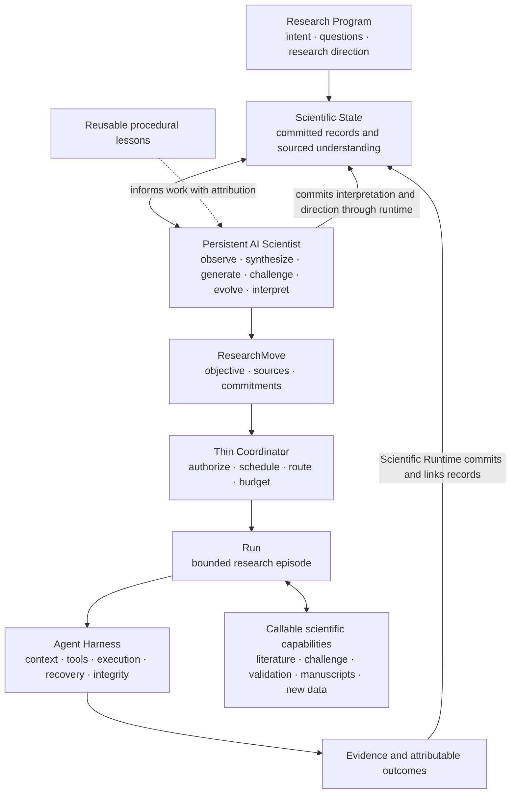

# Popper Architecture

**Popper is a persistent AI Scientist operated by a Scientific Runtime and a strong Agent Harness.** The Scientist owns scientific reasoning, evolving understanding and research direction across bounded episodes. Scientific Runtime preserves its state, identity, evidence and commitments; Agent Harness enables model-native action with context, tools, execution, recovery and enforceable integrity boundaries.

The target is `Research Program → Scientific State ↔ AI Scientist → ResearchMove → Run → Evidence → Scientific State`. A Run bounds work and resources; the research program and its accumulated understanding survive it. Persistence concerns scientific continuity, not a continuously active model conversation or a required background service.

Code is the source of truth; this architecture is a design hypothesis. It defines target responsibilities, contracts, invariants and semantics. Unqualified architectural statements describe the **target architectural contract**, not a claim of full implementation. **Current capability** identifies implemented behavior; **replaceable strategy** identifies one way to satisfy a contract. Logical responsibilities do not require new packages, services or agents. [ROADMAP.md](ROADMAP.md) records current implementation, historical strategies, sequencing and delivery scope.

## 1. Scope

- **Research Program:** a persistent scope of inquiry grounded in researcher intent, questions, evolving explanations, evidence and direction. Its Scientific State accumulates across Runs and may remain open after any individual episode or manuscript.
- **Target Run:** a bounded execution/research episode with declared objectives, resources and access. Its useful output may be observations, a challenged conjecture, a tested hypothesis, an inconclusive result, a justified next question, or a manuscript revision. A Run need not complete a study or paper.
- **Scientific scope:** framing, data grounding, observation, synthesis, explanation/rival generation, challenge, hypothesis evolution, discriminating experiments and interpretation. Literature, challenge, validation, manuscripts and new data are capabilities the Scientist may revisit in the loop (§4.8), rather than terminal phases.
- **Execution scope:** a Run may retain one selected tabular dataset and declared access/resource limits. These are episode constraints, not epistemic boundaries of the Program. The Scientist may conclude that replication, new data or another Study is necessary and record a next move. Execution requires eligible inputs and authorization; no automatic procurement, non-tabular backend or shared deployment is implied. Current support and delivery scope are recorded in [ROADMAP.md](ROADMAP.md).
- **Quality attributes, in priority order:**
  1. _Scientific usefulness_: find relevant, testable hypotheses and findings with enough sourced evidence and explicit uncertainty to justify further testing. Investigate alternatives, accumulate knowledge, and choose discriminating follow-ups; candidate count and favorable estimates alone are not useful discovery.
  2. _Recoverability_: learn from execution and scientific obstacles, preserve committed history, and continue justified research. Reproduce an execution where its environment permits; exact numerical reproduction is not guaranteed.
  3. _Traceability_: every empirical claim resolves to its measurement, execution and sources; execution alone does not establish scientific validity.
  4. _Honest labelling_: deterministic status and rule-based outcomes are computed from declared contracts; scientific assessments remain attributed and qualified.
  5. _Simplicity_: the smallest mechanism that meets these outcomes. Declared budgets govern resource allocation, not the scientific capability boundary.

### Design overview

Scientific Runtime governs the scientific contracts throughout this loop: state/record persistence, identities, ResearchMoves, ExperimentSpecs, evidence, exposure and typed transitions. A non-experimental move can retrieve prior work, challenge an explanation, revise a manuscript or assess new-data needs without fabricating an ExperimentSpec. Each capability returns sourced observations, assessments or artifacts to state; the Scientist interprets their implications and chooses what to do next. Trees, debate, tournaments, PI agents, graphs and executor backends remain replaceable strategies.

Existing systems are sources of mechanisms to investigate [1, 3, 4, 8, 32]. Their topologies are replaceable strategies, assessed by whether they improve scientific reasoning, discovery or accumulation while preserving these contracts.

## 2. Principles

The core vision is a persistent Scientist that develops and revises scientific understanding within a Research Program. Runs supply bounded opportunities to reason, gather evidence and act; their completion does not close the inquiry. Integrity safeguards accumulated knowledge and its evidence standing. These are commitments; §2.2 lists replaceable strategies; §2.1 applies regardless of quality-attribute priority.

1. **Useful discovery first.** The system helps the researcher find, test, understand or pursue a scientifically useful result. Candidates retain rationale, sources and uncertainty appropriate to their maturity; testable candidates identify discriminating observations. Negative or inconclusive studies can close unproductive directions or motivate useful follow-ups.
2. **Persistent Scientific State.** Keep what is observed, explained, challenged, attempted, failed and unresolved across sessions and Runs. Preserve research direction, identity and exposure while providing sourced understanding for the Scientist (§4.6, §9). Working views resolve to committed records.
3. **A scientific feedback loop.** Use `observe → synthesize → generate → challenge → evolve → select discriminating experiment → execute → interpret → update scientific state`. These are reasoning responsibilities, not mandatory phases or one agent each. Questions and conjectures can mature before becoming executable hypotheses. Never retry until a result looks favorable.
4. **Scientific identity and adaptation provenance.** Distinguish question, hypothesis, intended test, specification version, code and execution. Record the trigger, reason and changes (§4.6). Scientific changes cannot hide inside technical debugging.
5. **Separate evidence dimensions.** Provenance identifies an observation's sources; measurement fidelity checks the intended test; scientific validity concerns the inference (§4.7). Fresh execution does not establish all three.
6. **Independent challenge.** Separate generation from challenge. Fresh contexts, Critic and debate are strategies (§6). Challenge remains an attributed assessment, not independent empirical validation.
7. **Evidence regimes remain explicit.** Discovery can learn from failures and results. Locked validation requires a locked protocol and suitable unexposed evidence under its stated design; adaptive discovery cannot assign that standing (§11). Useful exploratory, descriptive, negative or inconclusive work need not end in validation or publication. This conservative validation regime does not claim that sample splitting is the only valid approach [17, 26, 27].
8. **Integrity stays hard.** Record every execution, preserve write-once artifacts, enforce access/sealed-data boundaries, compute labels in code and render paper numbers from committed named results. Scientific advice ordinarily supplies feedback rather than preventing an attempt. Protect researcher-confirmed intent explicitly.
9. **One source and owner.** Committed records remain authoritative. The Scientist owns interpretations, candidate selection and research direction. Scientific Runtime owns scientific contracts and state semantics; Agent Harness supplies generic enforcement mechanisms. Coordinator authorizes, schedules and routes within budgets. Derived knowledge never becomes a competing record authority.
10. **Capability gaps justify change.** Trace the existing mechanism and name the scientific behavior it cannot support. Adapt it in place when possible, and evaluate the resulting behavior (§13.1). External systems suggest options; architectural completeness or more tightly managed execution alone does not justify another layer.
11. **Simplicity and directness.** Prefer one authoritative path for each responsibility. Correct or retire restrictive and opaque paths instead of layering workarounds over them. Preserve integrity and the meaning of existing evidence; unmeasured preferences alone do not justify a wholesale redesign.
12. **Model-native agency with strong boundaries.** Give a capable model explicit state, tools, feedback and constraints so it can decide what scientific work is worth doing. The harness preserves native conversations and tool use while recording work, enforcing permissions and supporting recovery. Encode integrity and declared commitments in code; encode scientific advice as actionable feedback unless a specific boundary requires enforcement.

### 2.1 Invariants

These baseline protections have current enforcement paths. They do not certify general scientific validity or deployment isolation. The additional commitments below distinguish implemented scientific contracts from target extensions.

| Baseline invariant | Enforced by |
| --- | --- |
| Every model call, tool call, execution and decision is journaled | Harness (§7.5) |
| Run files are write-once; a fix is a new node, attempt or assessment | Run store (§9) |
| Accepted empirical measurements come from a fresh execution of the submitted script | Search engine and Ground submit (§4.3, §5.1) |
| Evidence labels are computed from declared rules | Search and publication responsibilities (§5.5, §10) |
| Reported empirical numbers resolve to named results; unknown names are flagged | Renderer (§10) |
| Research context, answers, dataset strings, outputs and retrieved text are untrusted data | Context assembly (§7.3) |
| No credentials in run files or script environments | Sandbox and run store (§7.4, §7.5) |
| Holdout rows never reach discovery nodes, sessions or tools | Run store at ingest (§11) |
| Code-supplied initial framing data omit computed between-column relations and holdout rows | Understand inputs (§4.1); researcher text and later Ground feedback may describe relations |
| Only researcher input confirms research-context metadata | Research-context schema (§4.1) |
| Descriptive statistics are computed by code | Initial data analysis (§4.2) |
| Dependency rules of §3 hold | Production components obey the dependency contract |

**Scientific Runtime invariants.** Exact references resolve committed producers and content hashes; accepted measurements bind hypothesis, intended test, implementation and execution; same-test repairs preserve the committed intended test; changed operational specifications get new identities and parent references; invalidation preserves prior measurements; prospective support is computed from declared matching rules. Current capability enforces these contracts within a Run. The target carries them across evolving candidates, linked Runs and manuscript claims, including transitive stale-state propagation and Program-wide exposure. Validation authority remains unavailable to adaptive discovery; executable validation and its labels are target architectural contracts. Research-context status `confirmed` means researcher-approved metadata, not empirical truth. None of these checks makes assumption truth or scientific validity mechanically decidable.

**Warnings versus boundaries.** Role/type conflicts, temporal-order concerns, few clusters, weak operationalization and unconfirmed assumptions supply scientific feedback and printed limitations. Access prohibitions, credentials, fabricated/missing evidence, sealed data and unauthorized edits of researcher-confirmed intent are integrity boundaries. A protected/excluded-column warning is not a substitute for enforcing an explicit access restriction. Method or robustness advice does not automatically become a code gate (§4.4–4.5).

### 2.2 Replaceable strategies

| Strategy | Current position | Reason to extend or change |
| --- | --- | --- |
| `Understand → Ground → Discover → Experiment → Communication` | Current playbook | These names identify current capabilities; Scientist-selected revisits replace fixed routing when evidence requires them. |
| Draft/debug/improve trees | Implemented within Discover; reuse | Compare completion, fidelity, selection and cost with bounded linear scheduling |
| Research Graph | Optional state/lineage strategy | Committed records become difficult to query or explain; no second authority |
| Fresh-context challenge, Critic, debate | Current separate contexts assess code and challenge candidates | Candidate and interpretation challenge retain separation from generation; topology remains replaceable |
| Discover or PI agent | Optional orchestration of the same contracts | Fixed routing limits useful discovery/recovery |
| Parallel branches, tournaments, hierarchical planners | Optional strategies | Sequential reasoning demonstrably misses useful alternatives or cannot use available resources; preserve ownership and exposure |
| Fixed baseline/main/robustness, Judge blinding and role sessions | Inner experiment/configuration strategies | Preserve useful execution/fidelity checks without imposing method, role or phase topology on scientific reasoning. |

Strategies do not substitute for core commitments. Added complexity must address an observed scientific capability gap and preserve the feedback semantics in §4; evaluation compares scientific usefulness and cost (§13.1). Historical records retain their original interpretation; compatibility mechanisms and delivery scope belong to [ROADMAP.md](ROADMAP.md).

## 3. Components and dependencies

| Responsibility | Target boundary | Owns |
| --- | --- | --- |
| AI Scientist | Persistent scientific agency over Program state | Observe, synthesize, explain, generate/challenge/evolve candidates, choose experiments, interpret evidence, maintain direction and write. Agency may span separate model sessions; continuity is carried by sourced state rather than an immortal conversation. |
| Scientific Runtime | Scientific contracts and persistence | Scientific State, ResearchMove, ExperimentSpec, scientific identity, evidence/exposure semantics and typed transitions. It preserves records, validates declared commitments and derives knowledge views; it does not decide scientific promise. |
| Agent Harness | Generic model/action mechanism | Native conversations and tools, context, execution/sandbox, journal, artifact integrity, resource accounting, resume, transport/technical recovery and access enforcement. Scientific validators are supplied by their domain owner. |
| Code-search strategy | Implementation within an experiment | Local draft/debug/improve, node acceptance and selection; node scores do not rank hypotheses. |
| Coordinator | Bounded authorization and scheduling | Authorize, schedule and route moves within Program permissions and episode budgets; track operational status. It neither interprets evidence nor ranks research. |
| Evaluation | Independent inspection of recorded behavior | Scientific usefulness, evolution, selection, continuity, traceability, recovery and cost (§13.1). Production never imports evaluation. |

These are responsibility boundaries, not mandatory packages, agents or services. Existing framing, grounding, discovery and communication functions implement scientific capabilities; they do not define a required phase topology. The package placement and current execution trace live in [ROADMAP.md](ROADMAP.md).

Dependency rules:

- `harness` imports nothing else in Popper. It supplies generic mechanisms and invokes domain-supplied checks without adopting scientific policy.
- `treesearch` imports only `harness`; it knows no stage goals.
- Function packages import only `harness` and `treesearch`, never each other. Their artifacts and contracts carry the scientific handoffs; calling a capability again does not require cross-imports.
- Only `coordinator` knows routing among capabilities. Scientific selection and interpretation belong to Scientist behavior; runtime projection belongs to scientific state semantics. Coordinator transports references and checks authorization/resources rather than duplicating either responsibility.
- Evaluation may depend on production components; production components never depend on evaluation.
- These rules are an import contract checked in CI, not a convention [30].
- Prompts and model configuration belong to the generic mechanism or scientific capability that owns the interaction. Configuration changes do not redefine scientific ownership or commitments.

Scientific Runtime is a logical boundary within these import rules. Scientific schemas/references may use shared transport without making scientific ranking harness policy. A change in package ownership must preserve a single authoritative contract, persisted-record meaning and explicit dependency rules. It must not make function packages depend on one another or make the harness depend on scientific reasoning. Literature tools supply resolved sources; execution backends preserve execution contracts. Program evidence and reusable procedural lessons have different meanings (§9).

## 4. Scientific research loop and episode contracts

The Scientist reads Program state, proposes a ResearchMove, acts within a bounded Run, observes the outcome and updates scientific understanding. Framing, grounding, experimentation and communication are reusable scientific capabilities in that loop. No fixed ordering, terminal publication phase or one-dataset epistemic boundary defines the Program.

### 4.0 ResearchMove and Run

A ResearchMove expresses what scientific work is worth doing and why (§4.6). A Run supplies a bounded execution episode: objective, authorized inputs/actions, resource limits, state frontier, selected work, committed outcomes and stop reason. A move may open a new Run or be scheduled in an active Run; one Run may execute several moves while its objectives, access and budgets permit. A move may also remain proposed or deferred when execution is unavailable. The target flow is semantic, not a mandatory one-move/one-Run allocation rule.

Completion means the episode has reached its declared stopping boundary. It does not mean a hypothesis is true, a Study is complete, a manuscript is ready or the Program is closed. Budget exhaustion, missing data, negative evidence and researcher suspension retain different operational/scientific meanings. The final episode record preserves usable outcomes, unresolved questions and pending work; the Scientist resumes inquiry from Scientific State rather than starting with fresh evidence entitlement.

ExperimentSpec is required when a move executes an intended empirical test. Literature reading, synthesis, challenge and manuscript review use their own input/output commitments. Their records identify the Program, move and producing episode without pretending to be empirical measurements. Scheduling a Run or finding a source does not itself confer evidence standing.

### 4.1 Research context and framing

**Research context** grounds the Program in researcher intent: a narrative brief with optional structured metadata supplies goals, domain, variable meanings, design, assumptions and constraints [3, 5, 33, 34]. An episode cites the context version it uses; it does not silently redefine the Program whenever a new dataset or Run starts.

- Research context covers domain, objectives, variable meanings and roles, study design, assumptions, constraints, and concepts. Ground owns the mapping from concepts to observed data.
- Researcher-confirmed metadata is distinct from agent-proposed and unknown information. Only researcher input confirms intent; models and downstream checks preserve that distinction and expose relevant uncertainty in the report.
- Guidance can shape an agent's interpretation, but cannot change deterministic integrity checks or computed labels.
- Scientific validators check supplied metadata against its declared inputs; harness treats researcher-provided text as untrusted data (§7.3).

**Framing contract.** A **Research Frame** expresses shared research meaning the researcher can recognize and correct. The Scientist can revisit framing when evidence, prior work, data limitations or intent changes. Subsequent framing cites the observations it has seen; reframing does not restore non-exposure.

**Current capability and strategy.** Understand provides framing through a Theorist session with role-free descriptive analysis and without code-supplied between-column relations or holdout rows [34].

- **Explore, critique, synthesize.** The agent chooses its own order and may repeat: restate and widen the problem, sharpen questions, find ambiguities, implicit assumptions and competing explanations, propose meaning, unit, type, role and order for undeclared attributes with evidence; critique its own framing (what is missing, alternative framings, the weakest assumption); then submit.
- **Researcher input and frame submission** allow questions, proposed or unknown metadata, and a structured framing with objectives, scope, uncertainties, and directions. Code checks schema and evidence, refuses changes to confirmed intent, and returns correctable failures to the agent (§7.1). Framing does not redefine metadata owned by the research context.
- **Review.** The researcher can confirm, revise, reject, or leave proposals unresolved. Only researcher input confirms intent. Automated runs preserve proposals as unconfirmed. A revision produces a new sourced framing attempt rather than silently changing confirmed metadata.
- **Current framing feedback** flags unsuitable outcome roles, excluded-column needs and duplicate directions. Such warnings do not replace explicit access restrictions.

The reviewed research context is the authority for confirmed intent and variable/concept meanings; framing holds attributed Scientist output. Ground uses concepts, valid ranges, codings and restrictions; exploration/candidates use questions and the foundation; experiments use design; manuscripts use scope and assumptions. Reframing commits a new version, reason and source references, retaining prior questions and their evidence. A scientific change to direction cannot silently change researcher-confirmed intent.

Literature or new-data assessment may inform framing whenever the Scientist calls them (§12). Resolved sources retain provenance and limitations. A new source does not replace intent, bypass Ground or acquire empirical standing merely through retrieval; a bounded Run may still use one selected dataset.

### 4.2 Initial data analysis

**Current capability.** Code computes descriptive statistics before and after accepted preparation [33, 34]. A shared computation path preserves named numerical artifacts; scientific capabilities own interpretation. The initial framing view contains no code-computed between-column relations or holdout rows.

Current primitives cover structure (rows, columns, duplicates and keys), quality (missingness, codings/ranges and unusual values), univariate distributions (location, spread, shape, quantiles and levels) and design descriptors (cluster/time structure where available). A statistic needs data/metadata support; missing or undefined measures stay explicit rather than invented.

Further descriptive evidence such as sample flow, characteristics, covariate balance, and design-based precision can help audit intended tests. Compute such evidence in its owning capability without duplicating descriptive logic. Sample characteristics and balance do not require significance tests [24]; diagnostic thresholds are design-dependent strategies, not universal scientific gates. Precision or an `underpowered` label needs an explicitly stated magnitude and design. Pre-test descriptions carry timing and exposure, especially when their rows are later called confirmatory or validation data (§11).

### 4.3 Empirical grounding

**Empirical foundation contract.** Grounding connects a Research Frame to what declared data actually observe: what they measure, how far they can be trusted, how each concept is represented and what is missing. The Scientist may revisit grounding for a new source, operationalization or diagnosed limitation.

**Current capability and strategy.** Ground provides checked preparation and foundation assessment through a Data Steward session (§6).

- **Responsibilities**, in the order the agent chooses: understand semantics/unit/structure/provenance and concept proxies; prepare with documented cleaning/transformation; interrogate anomalies/distributions/missingness; assess what the data cannot support. New data require an explicitly authorized source, input contract and empirical foundation; preparation cannot silently acquire or merge inputs.
- **Ground submissions** combine a preparation proposal with an operationalization of concepts and evidence-backed concerns. The harness executes the preparation freshly; Ground-owned validators check declared data invariants and evidence references before accepting outputs.
- **Current readiness feedback** is code-computed from accepted prepared data and records measurement availability, variation, missingness and design limitations. It supplies scientific feedback rather than a blocking scientific gate.
- **Operationalization is a proposal.** Current Ground outputs retain proposed standing; downstream reasoning and manuscripts identify them as proposals. Researcher-confirmed concept meanings remain distinct.
- **Frame concerns go back.** Ground never edits the research context. A material framing concern may open a researcher-visible revision and a new Ground attempt from the original data; unresolved concerns remain visible in the report.
- **Forbidden to use, not forbidden to see.** The Steward needs the outcome to prepare data, so it may see outcome–exposure relations. Preparation decisions must not be justified by the relation they produce [16]. Record the reason for each change and disclose raw-data access in the report.

### 4.4 Hypothesis quality

**Candidate maturation (target architectural contract).** Scientific candidates can be observations, questions, explanations, conjectures or rivals before they are precise hypotheses. Support `observation → question → conjecture/rival → hypothesis → testable hypothesis → ExperimentSpec` without forcing every idea through every step. Challenge may split, merge, retire or weaken a candidate as well as sharpen it. Preserve sources, uncertainty and revision lineage: a continuing idea retains its identity, while splits, merges or changed meaning create linked identities. Assign hypothesis/test identities when their meaning becomes explicit. A rival is an alternative explanation to investigate, not necessarily a negated directional prediction.

Only require fields justified by the candidate's maturity. An observation needs a source and context; a question needs an unresolved issue; a conjecture needs an explanation and its limits. A testable hypothesis needs distinguishing predicted observations and operational meaning; an executable specification needs inputs, procedure and outputs. Missing measurements or unresolved operationalization may justify literature work or new data instead of inventing an estimand. The target candidate contract does not require an estimand, direction or method until the idea becomes operationally testable; executable tests retain their stronger commitments.

**Testable quantitative contract.** A quantitative candidate may declare a primary estimand with distinct processed outcome/exposure columns, contrast, comparison, target population and unit, plus rationale, predicted/refuting outcomes and open MethodSpecs. Runtime assigns identities and preserves origins. This is a testable-candidate contract, not the schema for every scientific idea. Candidate count and method vocabulary do not define the target scientific topology.

**Ownership.** The Scientist owns hypothesis generation, challenge, evolution and next-move selection. Scientific Runtime and domain validators preserve candidate/test meaning and scientific warning semantics. Coordinator schedules selected moves, enforces episode limits and routes outcomes; it does not rank candidates or revise move intent. Harness enforces generic integrity and artifact contracts.

**Current feedback.** Nonblocking warnings identify unusable roles/types, exposure measured after outcome, excluded/protected columns, missing/proposed variable meaning, weak/absent proxies, unconfirmed/undeclared assumptions and few clusters. They are stored beside the hypothesis and printed in the paper. An explicit access restriction remains a separate hard boundary (§2.1).

Candidate-quality guidance is a replaceable strategy over sourced rivals, origins, predictions, pre-test support and any declared effect-size threshold. Independent challenge checks relevance, assumptions and discriminating tests (§6); no mandatory Critic rubric. A low-precision or underpowered label requires a defensible magnitude/design contract, not a blanket reason to block exploratory work. Method-fit advice starts as feedback. Any scientific gate must name the concrete failure it prevents and why permitting an attempt would be inappropriate; external evidence can justify adoption and local evaluation refines scope.

### 4.5 Analysis methods

**Current capability.** Adaptive declarations accept arbitrary nonempty method families; custom methods require an explicit algorithm. The generated-Python backend executes both known and custom declarations. Schema/integrity acceptance does not certify suitability or fidelity; those remain visible attributed assessments.

**Open `MethodSpec`.** Adaptive tests represent each method as a structured but extensible declaration: method family or `custom`, description/implementation reference, intended inputs and outputs, estimand/effect scale where applicable, assumptions and diagnostics. Known methods may use typed fields and reusable implementations; custom or generated methods state the same contract and undergo the same code, execution, fidelity and evidence checks. Unknown vocabulary alone does not make a method ineligible. A declaration enables an attempt; it does not certify suitability or validity.

Method-fit feedback uses outcome/exposure type, design, population, contrast, effect scale and inference assumptions. A categorical mismatch or diagnostic is evidence to diagnose or try a justified alternative, not an automatic scientific prohibition.

Sample support, balance, few-cluster inference advice, bounded/count-outcome methods and diagnostic-triggered variants have explicit design/assumption scope [34, 24, 25]. Record when/why a diagnostic is used; it cannot silently alter the primary method inside a repair. A changed planned test is refinement. Thresholds and enforced method policy need a rationale; neither cluster fixed effects nor normality tests universally determine a valid estimator.

### 4.6 Research state and scientific feedback

**Scientific State.** Program-scoped state retains candidate maturity/evolution, hypothesis/specification versions, attempts, evidence and invalidation, attributed interpretations/challenge, contradictions, questions, research direction, exposure and pending work. Episode counters/spend remain linked operational facts rather than the limit of scientific memory. Distinguish observations, commitments, proposals, assessments and computed statuses. Never turn an interpretation into an observation or an unresolved question into an answer. Existing record, snapshot and resume contracts remain the persistence foundation (§9).

**Scientist-facing knowledge (target architectural contract).** Present current explanations and rivals, their supporting/contradicting evidence, unresolved questions, abandoned ideas and promising directions alongside the operational history. The Scientist commits an attributed interpretation or synthesis after reading observations and challenge; the runtime derives the current view from those records. Rebuilding state does not recreate unrecorded reasoning. Summaries cite exact sources and a frontier, expose omissions, and permit retrieval of the full record. If a source is invalidated or superseded, mark affected interpretations stale pending reassessment. A graph or index is optional only when these queries become difficult on existing records.

**Current capability.** Within a Run, candidate challenge and result interpretations are committed with exact sources, rivals, limitations and open questions. The derived view feeds subsequent move reasoning and exposes interpretations affected by measurement invalidation. This implements bounded scientific feedback, not general candidate evolution or Program continuity.

**Scientific behavior and direction.** The persistent AI Scientist observes, synthesizes explanations, generates/challenges alternatives, evolves them, selects discriminating experiments and interprets the result across the Program. A model session or function package can supply domain expertise without becoming the Scientist's scope boundary. Runtime validates commitments and records changes; Coordinator schedules authorized work; Harness enables actions. Neither orchestration nor runtime computes scientific worth from node scores or deterministic rankings.

**Direction above individual moves (target architectural contract).** Keep a sourced, revisable account of the larger question, current explanatory commitments, important uncertainties, why a line of inquiry matters, and what sequence of evidence could resolve it. Each move explains its contribution to that direction or why it changes it. The Scientist can pursue a prerequisite, replication or initially costly experiment whose value appears over several moves; immediate information gain is not the only objective. Update direction after interpretation, contradictions or researcher steering. A committed narrative and references can satisfy this contract; a separate planner, graph, PI hierarchy or numerical utility function is not required.

**ResearchMove contract.** Every proposed move cites the Program/state frontier and records objective, sources or evidence trigger, action, estimated cost and stopping condition. Action-specific commitments include scientific identities, assumptions/exposure and expected discrimination where applicable; a stop need not invent predicted observations or a test. Actions can investigate, synthesize, challenge, mature/evolve candidates, consult literature, execute a test, repair/refine, revise scope, assess new data, validate, write/review or stop an episode. Reject incomplete proposals with actionable feedback and retain their disposition. Scheduling records the producing Run and its authority/resources without changing scientific meaning.

Reasoning moves need not declare a hypothesis/test. They retain the same sourced proposal/disposition history, including how the move serves direction, which alternatives it displaced and whether a missing source or unavailable route prevents action. Repeated capability calls remain distinct attributable work; an unavailable capability produces a visible deferral, not invented evidence. A recommendation for another episode is useful scientific output, not a completed experiment.

**Budget allocation.** Scientific allocation considers relevance to Program direction, expected discrimination, unresolved uncertainty, feasibility, diversity and cost. The Scientist recommends work; Coordinator enforces declared episode limits and any Program-wide allocations. Budgets do not reset on resume or silently expand when opening another Run. A separate allocation component is a replaceable strategy. Do not optimize significance, favorable direction or agreement with expectations; record reasons and displaced alternatives and preserve spend/exposure when reallocating.

**Scientific identity and ExperimentSpec.** Distinguish Program, question/candidate, hypothesis, intended test/version, implementation, move, Run and execution. Scientific identities and lineage survive episode boundaries. **ExperimentSpec** names the immutable scientific execution contract; current capability provides this contract for quantitative analyses. It commits selection/preparation, open methods, inference/adjustment, requested coverage, outputs and optional support rule. An exact measurement reference links a named result to hypothesis, test, implementation and execution; cross-episode resolution also identifies its source Run. New versions retain parent references. Changed preprocessing, sample selection, seeds/replications or inference effort changes the specification when it changes the intended test or precision.

**Typed transitions.** Diagnosis (§7.6) and adaptation are separate. Record trigger artifacts, diagnosis, author, reason, before/after identities and changed fields. Current specification comparison distinguishes same-test repair, operational refinement and changed-target pivot. The table below is the target semantic contract, including routes not yet executable. Agents propose scientific changes; code enforces declared identity/access boundaries rather than judging scientific promise. Hypothesis evolution can change explanatory content even when columns stay the same; identity checks must preserve that distinction instead of defining a hypothesis solely by its estimand.

For computed hypothesis-support standing, the specification/hypothesis must commit the null, direction, comparison or decision rule, and any margin before the execution that produces the evaluated evidence. A rule declared or changed after seeing that result is post-hoc: retain the measurement and provenance, but report support as exploratory/post-hoc rather than computed under a prespecified rule. A later refinement cannot retroactively make an earlier result prespecified.

| Transition | What stays the same | What changes and must be recorded |
| --- | --- | --- |
| Technical repair | Scientific specification | Code/execution to fix runtime or implementation failure |
| Measurement repair | Intended scientific test | Measurement implementation to correct units, estimator, contrast or data-slice bugs; append invalidation of affected measurements, preserving old records |
| Scientific refinement (`refine`) | Question and substantive hypothesis/primary estimand | New specification/version: changed method, adjustment or operational test; retain prior evidence |
| Hypothesis pivot (`pivot`) | Scope, unless explicitly reframed | New hypothesis identity; retain prior hypotheses and negative/failed tests |
| Reframing (`reframe`) | Prior inquiry and evidence provenance | New question/scope/frame; changes to researcher-confirmed intent require researcher input |

Measurement repair restores the recorded intended test; a change to the intended test requires a scientific transition, not repair. Separate semantic specification changes from measurement/code revisions. Negative estimates, lost significance or contradiction are not technical defects. Corrections cannot erase exposure to earlier results. Resource pressure is a trigger, not an exemption: reducing sample size, dropping seeds, switching estimator or weakening an intended uncertainty calculation must be recorded as a scientific change. A faster implementation is technical repair only when the intended test and numerical fidelity remain unchanged.

Refinement may change the analyzed slice while retaining the declared target estimand and disclosing any new generalization assumptions. A change to the target population, substantive contrast or primary estimand creates a new hypothesis/test (`pivot`), or a `reframe` when the question/scope changes. Restoring the already-declared contrast is measurement repair; deliberately changing the operational procedure while retaining the substantive estimand is a versioned refinement. A faithful faster implementation is technical repair. When the prior specification does not resolve that distinction, record uncertainty and propose a scientific change rather than infer a convenient repair identity after seeing results. Technical repair addresses runnable implementation; measurement repair corrects an affected empirical measurement, even if it also fixes runtime code.

**Interpretation and next moves.** The Scientist separates implementation/fidelity defects from scientific observations, compares evidence with predictions, rivals and prior work, and commits what it changes in Program understanding. Challenge can question that interpretation; writing or new data can expose another unresolved issue. An unexpected/null observation may narrow an explanation, weaken it or motivate replication; it is not automatically a repair. Technical defects may use inner code debugging; scientific changes use typed ResearchMoves. Stop a Run at its episode boundary while retaining unresolved direction and useful outcomes in state.

**Risk: a closed epistemic loop.** Better self-healing can produce better execution and worse inference if the agent repeatedly changes the test, selectively retains favorable measurements or treats its own critique as final proof. Keep all attempts and their exposure/changes visible; distinguish repair from a new test; bound adaptation; and reserve validation standing for eligible locked validation (§11). Provenance makes this risk inspectable but does not statistically eliminate it.

Choose revisit eligibility, limits and stopping rules before the revisit; require a sourced defect, unresolved scientific question or declared diagnostic trigger. Effect sign, significance, `stable` status, agreement with the expected direction and a flattering narrative are not completion/selection objectives. Discovery can respond to unexpected evidence with an attributed question or change; that remains adaptive exploratory work. Preserve initial and subsequent measurements with the reason and timing of selection. Blinding a Judge cannot prevent result-driven choices elsewhere in generation, preparation or routing.

**Checkpoint, resume and fork semantics.** A checkpoint references committed input/output artifacts, identities and pending work; it never promotes scratch or an incomplete execution into evidence. Resume continues the same specification unless an explicit transition changes it. Fork means a new lineage from a committed checkpoint: same intended specification with code/measurement correction is repair, changed specification is refinement, changed hypothesis is pivot, changed question is reframe. A fork retains parent references, prior results, exposure and recorded resource allocations; it never gets a fresh validation entitlement or unjournaled reset. Current append-only child attempts and resume provide this lineage within a Run. Broader fork interfaces are replaceable strategies, not part of scientific identity.

Transitions are bounded and typed. An unavailable route is deferred with its reason rather than silently substituted or treated as completed. Candidate count, additional agent roles and parallel infrastructure are replaceable strategies; state identity, commitments and exposure apply to all of them.

**Adaptive discovery (target architectural contract).** Manage multiple hypothesis and specification candidates, their origins, selection reasons, allocated resources, dispositions and follow-ups. Origins can include frame, observation, rival, literature and follow-up [22]; cite artifacts and record whether test data suggested the hypothesis. Select for relevance, discriminating value, unresolved uncertainty and feasibility under declared objectives, without rewarding significance or agreement with an expected result. Structured predictions and pre-test descriptions can improve fidelity when their scope and timing are explicit. Primary, rival and auxiliary tests have separate standing. Non-detection of a rival does not establish the preferred hypothesis; a control interval covering its null does not prove equivalence. Locked validation is optional and separately authorized (§11).

Independent challenge, sourced interpretation and literature reasoning are scientific responsibilities even with sequential execution. Parallelism is optional when useful research work requires it.

**Concurrent branches (replaceable strategy).** Each branch owns its attempts and execution directories and cites its parent checkpoint and hypothesis/specification identities. Scheduling records allocations and selection decisions; shared commit and resource accounting must handle concurrent writers. Resume retains pending, completed and abandoned work without accepting incomplete evidence or duplicating an accepted execution. Shared findings enter the state through committed records; record which findings informed each subsequent choice. Parallelism never resets exposure or validation entitlement. Trees, tournaments, debate and PI/Discover agents implement these contracts as replaceable strategies (§2.2).

### 4.7 Evidence semantics and backward chain

The target chain is `claim → measurement → specification → execution → code → data slice → assumptions/provenance`. It links records, not necessarily graph nodes. Every reported number resolves to a named measurement and execution. Each figure resolves to its generating code and source measurements. Provenance identifies origin; it does not establish fidelity, validity, or validation standing.

| Dimension | Question | What it cannot establish alone |
| --- | --- | --- |
| Execution and coverage | Did execution finish and which requested samples/seeds/conditions/outputs were completed? | Fidelity, sensitivity or support; failed coverage is not negative evidence |
| Provenance | Which code, inputs, slice, specification and execution produced this result? | That implementation measured the intended quantity |
| Measurement fidelity | Are units, contrast, estimator, selection and implementation faithful to the intended test? | That assumptions hold or adaptive inference is valid |
| Hypothesis support | What does the pre-execution declared comparison/decision rule say about this prediction? | Truth, equivalence from non-rejection, or valid post-selection inference |
| Robustness sensitivity | How do comparable completed estimates change across declared variants? | Execution coverage or support; consistent null estimates can be insensitive |
| Validation standing | What did an eligible locked protocol on suitable unexposed evidence conclude? | Universal truth, causal identification or transport to other populations |
| Scientific validity | Does design/evidence justify the claim given assumptions, selection, multiplicity and exposure? | Broader generalization or causal identification without supporting design |

Execution status, measurement validity, hypothesis support, robustness sensitivity and validation standing are separate concepts. Compute support only when its rule predates the evaluated execution; otherwise mark it exploratory/post-hoc. Model interpretation cannot promote evidence status. A corrected measurement appends a superseding record and invalidates dependent claims without deleting history. Refinement creates new evidence rather than replacing an unfavorable test.

The research process maintains identity and feedback semantics. Claim verification checks that the paper faithfully reports committed evidence and flags unresolved, superseded, or invalidated lineage. It is separate from scientific assessment and the locked validation protocol in §11. Scientific validity may remain limited or unknown even with complete provenance and successful execution.

**Evidence registry and claim resolver.** A derived index resolves claim and figure references through the chain above, using committed artifacts and named results as the single source across linked Runs. It exposes missing, invalidated and superseded links during research and manuscript work. Domain owners define fidelity checks; the resolver checks references and standing without duplicating measurements or granting scientific validity. Existing evidence manifests and result contracts remain valid foundations.

### 4.8 Callable capabilities and feedback

**Target architectural contract.** The Scientist chooses which capability to invoke from explicit state, direction, evidence and constraints. These calls may occur before, between or after experiments, and may recur across Runs. They are not terminal phases or mandatory checkpoints:

| Capability | Commitment and return to Scientific State |
| --- | --- |
| Literature reasoning | Read/resolve cited sources, record passages/provenance and compare prior work with explanations or experiments. Missing sources remain explicit; model recall does not become evidence (§12). |
| Independent challenge | Challenge candidates, assumptions, discrimination or interpretation from cited records with separation from generation. Return attributed objections, rivals and possible checks; agreement is not validation (§6). |
| Validation | Lock a justified protocol before access and preserve source/exposure and verdict authority. Return computed standing and limitations; disclosed feedback may motivate new inquiry but cannot authorize adaptive reuse of validation evidence (§11). |
| Manuscript and review | Maintain evidence-backed versions and return unsupported claims, contradictions or missing science as sourced questions or ResearchMoves. Build/readiness status does not close the Program (§10). |
| New data and replication | Assess which observation is missing, source suitability, access and design; propose eligible data or another Study/Run. Authorized inputs pass Ground before measurement; acquisition is optional, provenance and exposure are mandatory (§12). |

Each call cites its input frontier and sources, records the work performed and returns observations, assessments, artifacts or a deferral. Runtime commits these records; the Scientist interprets their scientific implications. A literature statement or challenge assessment is evidence of an attributed source/assessment, not a fresh empirical measurement. Updating state cannot upgrade its standing. The next move may revisit any capability justified by the updated understanding.

## 5. Experiment execution and code-search strategies

**Current capability.** A generic engine runs code-search stages for exploration and experiments; framing and grounding use agent sessions. Each stage supplies a goal, authorized inputs, required outputs, checks and assessment context. Adaptive moves reuse scoped experiment requests. The engine owns implementation mechanics, not scientific direction or hypothesis ranking; tree search is a replaceable strategy.

### 5.1 Node

- In the current tree strategy, one implementation attempt at the stage goal ends by submitting a self-contained script. Its Analyst session is a role configuration (§6), not a required Scientist topology.
- The harness re-runs the submitted script from scratch in the sandbox. Only that run's results file, figures and log count.
- **Named results:** each execution records result names with values and any associated uncertainty, sample size, or note. A capability declares required results; missing required evidence fails its contract. Rendering, audits, robustness summaries, and validation read committed results rather than reconstructing numbers from prose.
- An attempt records its stage, ancestry, type, outcome, assessment, and reason.

### Execution boundary

An ExperimentSpec declares the intended test independently of its execution backend. The Scientist selects the test; an implementation strategy builds code; Harness executes it and records outputs. The backend does not interpret scientific meaning. A backend substitution must preserve identity, access, fresh execution, provenance and named results. Executors cannot revise a specification or promote evidence standing.

The target boundary is `ExperimentSpec → Executor → ExecutionArtifact`: semantic contracts, not required classes or services. Concurrent executions use exclusive output locations and shared resource accounting. Cancellation, timeout and partial completion leave recorded status and diagnostics; only committed, accepted outputs enter the evidence chain.

### 5.2 Step policy

The inner strategy chooses implementation attempts under a declared experiment goal, inputs, checks and budget. Local debugging preserves the intended test; improvements cannot silently change its scientific meaning. Node score and goal completion assess implementation only. Scientist compares ResearchMoves from Program state and direction separately (§4.6); code-search scores cannot become scientific rankings.

### 5.3 Node evaluation

1. **Integrity checks.** Deterministic checks determine whether an execution completed and produced its required evidence. Invalid or incomplete outputs are not accepted as empirical results.
2. **Independent assessment.** A separate assessment evaluates implementation correctness, completeness, and fidelity without rewarding effect size, direction, or significance [16]. It may receive the information needed to diagnose fidelity, while its assessment cannot establish scientific validity.
3. **Selection.** The stage selects among eligible attempts under its declared goal and policy. All attempts and their estimates remain visible so selection cannot hide the spread of outcomes.

**Current capability and replaceable strategy.** Local acceptance, structural observations and attributed fidelity retain separate diagnostic meanings. Judge blinding is an assessment strategy. Assessments may use declared contrast, units or implementation details needed to diagnose fidelity, but must not rank work by effect size or significance. Neither a score nor successful execution establishes scientific validity.

### 5.4 Experiment strategies

`baseline → main → robustness` is a current inner experiment strategy. Exploration, a transparent baseline, planned analysis and sensitivity checks are available goals, not a mandatory scientific sequence. The Scientist selects an experiment appropriate to the question/hypothesis; its ExperimentSpec declares the work and required outputs. Concrete stage configuration belongs to [ROADMAP.md](ROADMAP.md).

Experiment work has declared budgets and stopping conditions. Sensitivity schedules are committed before execution and remain replayable; repairs consume declared resources. Same-test repairs retain scientific identity, while changes to the intended test require a version and transition (§4.6). Execution feedback preserves enough diagnostic evidence to explain failures.

### 5.5 Robustness and stability

**Current capability.** Adaptive specifications declare alternatives before execution and record requested/completed coverage, attributed fidelity, sensitivity and optional prospective support separately. Missing alternatives remain explicit. Direction and interval-overlap comparisons are a current replaceable strategy, not a general scientific verdict or a complete equivalence/scale-aware analysis.

**Comparability contract.** Support rules require an explicit effect scale/null: a ratio's null is 1. Same-estimand comparisons require comparable contrasts, scales and populations; a changed subgroup can be a secondary estimand. A null-consistent result is scientific evidence, not implementation failure. Label reasons and unsupported/comparison cases remain explicit.

Separate (1) requested/completed coverage and failures, (2) observed sensitivity among completed comparable variants, and (3) support under the declared null/direction rule. Missing or non-comparable evidence makes sensitivity unavailable/limited, not automatically high; consistent intervals spanning the null may show little sensitivity with inconclusive support. No declared rule means unknown support. A placebo interval containing the null is only a diagnostic observation, not proof of a valid design or absence of bias.

**Historical evidence constraint.** Existing `stable`/`fragile` summaries retain their original rule, version and reasons; their zero-centered computation is never silently reinterpreted. They mix coverage, directional support and sensitivity without established error calibration. Any changed rule needs a new version. Reports expose the separate evidence dimensions alongside such a summary and keep its standing exploratory. Neither label establishes general scientific standing, and `fragile` alone does not make an unsupported positive claim acceptable. The historical algorithm and defaults belong to [ROADMAP.md](ROADMAP.md).

**Replaceable strategies.** Robustness [14, 15] tests sensitivity to justified processing, specifications and resampling, with adversarial checks [6, 11]. Rival/auxiliary tests and confounding sensitivity bounds have separate semantics rather than being put in a stability denominator. Structured predictions and diagnostic-triggered variants retain declared timing and scope. Multiplicity/adaptive selection require a defined family and protocol; adjustment over only the final reported hypotheses does not account for all adaptive attempts.

### 5.6 Analysis checklist

Guidance for implementation and scientific challenge [16, 18, 19]. Integrity checks are enforced in code; methodological advice supplies diagnosis/refinement rather than pretending a prompt guarantees validity:

- justify a processing choice by validity, never by the relation it produces;
- flag derived variables that use the outcome;
- report every rule that drops rows;
- prefer effect sizes with intervals over p-values alone;
- choose assumption handling from descriptive measures, not normality or variance tests;
- keep association distinct from causation in observational designs.

## 6. Role strategies and independent challenge

A role is a prompt, tool set and model route. Theorist, Steward, Analyst, Judge and Writer are current configurations, not required actors or a fixed session order. The persistent Scientist can call the same capabilities through another configuration. Separate contexts can provide access separation or independent challenge; a multi-agent topology is not core.

| Current role configuration | Current capability |
| --- | --- |
| Theorist | Framing, candidate generation and ResearchMove proposal/selection |
| Data Steward | Checked preparation, proposed operationalization, concerns and readiness |
| Analyst | Builds and tests one implementation attempt |
| Judge | Separate-context typed code/fidelity assessment and a distinct candidate-challenge session |
| Writer | Evidence-backed reports with partial/diagnostic fallback |

These configurations implement parts of Scientist behavior; they do not divide Program ownership. Independent candidate challenge is current capability; independent challenge of interpretations remains a target contract. Dedicated Scientist, Critic or PI agents remain replaceable strategies.

**Challenge is normal scientific reasoning (target architectural contract).** Challenge candidate explanations before expensive commitment, experiment discrimination and assumptions before execution, and interpretations after surprising evidence or during writing. A challenge may motivate a rival, narrower claim, literature query or another move; it is not only final review. Start from cited candidate/interpretation records and evidence without treating the generator's conversation as premises. Assessments are attributed and cannot edit evidence, labels or confirmed intent. Self-reflection alone does not provide separation; a fresh context reduces conversational self-confirmation but can share model bias. Debate agreement is not independent empirical validation. Avoid a mandatory critic gate on every minor action; use challenge where it could change scientific understanding or choice.

Sequential sessions and artifact hand-offs are a current strategy. Fresh-context challenge, debate, tournaments and specialized agents are replaceable configurations over the same contracts. Preserve attributable assessments and selection reasons across strategies. No role overwrites another role's outputs.

Researcher answers, review and later hypothesis/scope choices are attributed. Autonomous routes cannot silently revise confirmed intent.

## 7. Harness

The Agent Harness is model-native and generic: it enables agency with legible context, tools, execution, feedback and constraints. Scientific contracts may share transport and storage with harness mechanisms (§3); their physical placement does not make scientific interpretation or selection harness policy.

### 7.1 Agent loop

An agent session uses a configured model route and a bounded set of capability-appropriate tools. Structured submissions are validated before their effects are accepted; domain-owned checks define domain semantics. A rejected submission returns actionable feedback within the session budget. Provider transport recovery is journaled but is not itself a research attempt.

### 7.2 Tools

Tools expose explicit permitted artifacts and actions. Current sessions use phase-specific tool sets; target Scientist sessions should be able to inspect relevant state and request authorized scientific actions without a fixed phase hiding needed feedback. Tool access retains input allowlists and sealed-data boundaries. Scratch analysis and accepted fresh execution remain distinct. Domain-owned submission checks return actionable feedback through generic harness handlers. Researcher answers are attributed and presented as untrusted data. Every invocation/result is journaled [29].

### 7.3 Context assembly

Each session's context is assembled from authorized Program state, exact source records and active episode inputs. A working conversation can grow within a session; scientific continuity across sessions comes from committed state rather than implicitly inheriting another conversation [28]. A fresh context or new Run does not reset exposure.

- **Just in time:** artifacts are listed by name and read through tools.
- **Scientific State view:** compact sourced context exposes Program explanations, contradictions, direction and relevant episode history, with omitted references available for permitted retrieval (§4.6). Runtime prepares the projection; harness delivers it as context. Summaries remain replaceable views, never a second authority.
- **Implementation hand-off (current strategy):** an Analyst receives its parent's attributed assessment rather than the parent's full conversation. This does not supply independent scientific validation.
- **Context limits:** omissions and truncation are explicit and journaled; required contract lists are never truncated. Compaction and summarization cannot invent records or reset exposure.
- **Untrusted content** is wrapped and marked; every system prompt states it is data, never instructions.

### 7.4 Execution and access boundaries

- Accepted script measurements come from fresh execution in an exclusive output location under declared time/resource limits. Scratch output remains separate and cannot become evidence by copying or snapshotting it.
- Scripts receive only authorized inputs and runtime/library resources. Credentials never enter script environments or Run artifacts; inputs and harness code/logs are protected from writes.
- **Current local protection:** a Python worker audit hook constrains reads/writes, resolves symlinks, denies sibling/Run-root reads and subprocess launch. It prevents accidental access, not hostile native extensions; local use has no container or network isolation.
- **Deployment constraint:** container isolation is required before shared use [4]. A replaceable executor must enforce the same scientific access, identity and evidence contracts.

### 7.5 Journal and run store

- **Journal:** append-only events record model calls/cost, tool actions/results, executions, attempts, artifact commits and decisions. Context omissions and explicit budget changes are traceable. An interrupted tail remains preserved; continuation appends recoverable history rather than overwriting it. Corruption fails visibly.
- **Run store:** committed episode inputs/outputs are write-once. Status and cost changes append checkpoints citing prior state and artifacts. Resume restores resource/policy state, preserves incomplete attempts and never resets spend. Episode checkpoints do not define the lifetime of Program Scientific State (§9). Explicit budget changes remain attributable. Interactive/automated work preserves unresolved intent; unrecorded cost at process death cannot be recovered.
- **Trace completeness:** code, outputs, seeds and execution/journal records remain resolvable so a Run retains its own trace [12].

### 7.6 Budgets and failures

Resource caps are finite and nonnegative. Limits apply separately to run cost, agent sessions, analysis attempts, local repairs, and scientific revisits. Validation exposure accounting follows §11.

LLM capacity is expandable. Configurable budgets cap work among candidates, challenge and executions. The Scientist selects work and recommends allocation; Coordinator enforces the total cap and schedules. Allocation topology is a replaceable strategy (§4.6). Budgets provide explicit stopping rather than a fixed product capability limit. Concurrency limits protect executor capacity and consistent accounting. More resources permit more work under the same integrity and exposure contracts.

The harness records technical/access/resource facts. Scientific Runtime and domain validators attach measurement semantics; the Scientist diagnoses evidence and chooses a response. Current capability records typed structural observations, diagnoses and fidelity alongside local acceptance. The following taxonomy defines distinct meanings; it does not place scientific policy in the harness or assert that every response route is implemented:

| Failure/outcome class | Example | Handling |
| --- | --- | --- |
| Provider transport | Throttling, request timeout, 5xx | Bounded backoff; not a scientific attempt |
| Execution/technical | Script timeout, dependency/runtime error | Technical repair if specification can be retained |
| Implementation | Wrong API or code logic | Same-test technical repair; diagnose measurement impact before accepting results |
| Measurement | Wrong units, contrast, slice or estimator implementation despite successful exit | Measurement repair; append invalidation. A changed intended test is refine/pivot/reframe according to identity (§4.6) |
| Scientific | Negative/contradictory evidence, low precision, unsupported assumption | Report, refine, pivot or reframe with proper identities; not an implementation failure merely for unfavorable evidence |
| Validation | Not supported/inconclusive under a locked protocol; protocol violation | Record outcome separately from execution failure or invalid validation; no adaptive retry on exposed evidence |
| Integrity/access | Untraceable/fabricated evidence, unauthorized inputs/writes, sealed access | Hard-block action; preserve diagnostics; no scientific override |
| Resource/terminal | Money/turn/revisit cap, no executable result | Clean stop and explicit reason; best available partial output where possible |

Class diagnoses the problem; transition chooses the change (§4.6). Provider retry, tree debug, measurement correction and hypothesis pivot are not one retry counter or success metric. Bound each inside the total budget; preserve spend/counters and observations informing changes on resume.

No failure path edits artifacts. Resume uses committed attempts and journal. Only an explicit journaled researcher action may raise the money cap; agents/config reloads cannot. Raising it does not reset spend or evidence exposure. Record requested versus completed sample/seed/condition coverage and relevant environment constraints; unknown termination is not automatically OOM. A runtime timeout is observed feedback, while its scientific diagnosis is an attributed assessment. Environment/package changes stay explicit and generated scripts do not install undeclared dependencies or receive credentials.

### 7.7 Operational status

Harness status describes activity, resources and execution outcomes. An implementation score or completed schedule cannot imply scientific progress, support, manuscript readiness or Program completion.

### 7.8 Artifact contracts, integrity and human escalation

**Current capability.** Typed submissions, exact artifact/measurement references, execution manifests, access allowlists, journal, write-once commits and researcher review enforce declared boundaries. Cross-run contracts, transitive invalidation and richer decision-specific escalation are target architectural contracts.

**Artifact contracts.** Each capability declares permitted input artifacts/versions, required or optional outputs, structural checks, owning producer and completion conditions. An output identifies its sources and, when scientific, hypothesis/specification/execution. Pass committed paths/references in hand-offs rather than unsupported context assertions. Optional figures or a PDF cannot invalidate an otherwise faithful measurement; missing required empirical evidence cannot be replaced by prose. Typed declarations and domain-owned checks can satisfy this contract without a universal artifact ontology, registry service or duplicate evidence store.

**Integrity checks.** Existing access, schema/reference, execution and resource checks return machine-readable observations and enforce declared boundaries. Scientific validators own domain semantics; Scientist diagnoses/refines and Coordinator routes. They cannot judge novelty, scientific worth or statistical truth. Suspicious-but-possible observations motivate warnings/challenge rather than automatic rejection.

**Targeted HITL.** Ask at unresolved decisions that materially change researcher intent, operationalization, scope or a validation commitment. Routine same-specification repair and harmless execution scheduling do not need approval. Decision-specific escalation records its trigger, options, consequences and resolution through researcher questions/review. A proxy with materially weaker meaning needs explicit provenance and escalation when it changes confirmed meaning; other proposals may proceed with limitations. Automated work retains proposed/unknown standing or defers unresolved decisions; silence never confirms intent. Current initial researcher review remains an implemented boundary; targeted escalation does not silently remove it. Resource cap raises remain explicit researcher actions (§7.6).

Human decisions and their supporting evidence are attributed and committed; unresolved choices remain proposed or deferred.

**Graceful degradation.** Partial, inconclusive and exploratory-only reports are valid products when their standing, missing coverage and stop reasons are visible. Distinguish coverage (partial/complete), scientific outcome and validation standing from operational run status. Keep accepted measurements, invalidate affected ones by appended record and block unsupported claims, not the diagnostic report as a whole. With no accepted empirical measurement, emit a failure/diagnostic report with no empirical findings; do not manufacture a completed study. Preserve a cheap deterministic report path when no model budget remains; PDF failure preserves source/logs. The current renderer's deterministic fallback satisfies partial reporting without a parallel writer.

## 8. Typed assessments and selections

Current capability provides typed local code assessments for acceptance, goal completion, score and fidelity, and separate typed ResearchMove proposals/selections with rationale. These are different decisions: a local implementation assessment cannot rank scientific hypotheses or establish evidence standing.

The Scientist owns comparisons of scientific relevance, explanatory value, discrimination and cost. Runtime checks validate referenced options, commitments and identity; Coordinator enforces authorization and resources. Computable facts and labels remain code-owned. An assessment records author, inputs, scope, rationale and uncertainty; invalid output receives bounded feedback or a recorded stop/defer, never a fabricated successful decision.

A separate decision model [31] is a replaceable option only when an observed cost or judgment-quality gap warrants it. Any comparison/shadow strategy retains both inputs and attributed outputs; agreement with the current Judge is not correctness ground truth. It cannot override integrity checks, compute empirical values from prose or acquire authority merely by reporting confidence. Decision topology and model routing remain replaceable strategies.

## 9. Persistent Research Program and Scientific State

**Research Program.** The Program is the persistent scientific scope: researcher intent, questions, explanatory commitments, unresolved contradictions, direction, evidence and research artifacts. Its identity survives bounded Runs and their operational failures. It can pursue several related questions, datasets or replications without erasing their distinct design and evidence regimes. Program persistence is a target architectural contract; current Run-local persistence does not supply general Program continuity.

**Study and Run.** A Study can group a coherent investigation with its question, design and evidence scope when that grouping clarifies the science. It is not required for every move or a prerequisite storage layer. A Run is a bounded episode of work within the Program, optionally associated with a Study (§4.0). Episode completion, Study completion, manuscript readiness and Program continuation are independent statuses. Current reporting transports one Run's records; that transport does not create a persistent multi-run Study.

**Scientific State and authority.** The authority is the append-only history of committed inputs, scientific records, executions, results, assessments and decisions. Records identify Program/producer, exact sources and relevant scientific/episode identities. New explanations, revisions and corrections append records rather than overwrite the evidence that prompted them. Run-local files may remain where produced; a Program can link exact source records rather than copy their evidence into a second store.

Scientific State combines this durable record history with a derived Scientist-facing view. The view exposes current explanations/rivals, supporting and contradictory evidence, usable and invalidated measurements, uncertainty, unresolved questions, candidate evolution, research direction and pending work. It distinguishes researcher-confirmed intent, proposals, observations, attributed interpretations and computed statuses. Synthesis is itself committed and attributed; rebuilding a projection cannot invent unrecorded scientific reasoning. Source/frontier references, omissions and stale interpretations remain inspectable. A graph or index is optional and never an authority.

**Cross-episode identity and access.** Resolving prior work requires an explicit source-Run identity, exact committed references and a read/access contract. Existing run-confined references are not made global by permitting arbitrary paths. Carry source data/slice identity, selection, evidence standing and exposure across linked Runs. A new episode, model session, dataset alias or copied artifact grants no fresh validation entitlement. Imported measurements remain prior observations with their original design and limits; they are not new executions.

**Continuation.** At an episode boundary, preserve its committed outcomes, unresolved issues and selected/pending work. The Scientist returns to the Program's state, verifies what remains usable and justifies the next move from the current frontier. Episode recovery can complete an interrupted attempt; a changed hypothesis, specification or scope still needs an explicit transition. An unavailable source/capability is a recorded blocker or deferral within the inquiry, not a reason to discard scientific history. A Run may end with evidence, failure, contradiction or a next question without a manuscript.

**Staleness and exposure.** Corrected measurements preserve prior versions and invalidate affected uses. Derived understanding and manuscript claims expose dependent sources that are invalidated, superseded or unresolved; the Scientist commits a reassessment before treating them as current support. Scientific interpretations may remain contested even when references resolve. Sourced prior-work and transferred data-specific facts count as exposure where relevant. Storage separation or model separation alone does not establish independence.

**Procedural learning has separate scope.** Reusable lessons/skills describe how to work: a repair pattern, diagnostic technique or experiment-selection heuristic with attribution, applicability and limits. They advise scientific or execution behavior but do not supply an empirical finding. Program accumulation records what has been learned about its scientific questions. Prior Program evidence can inform a later interpretation with its original standing; procedural advice cannot substitute for that record, override constraints or grant validation.

Capture, retrieval/use and correction/retirement of procedural lessons remain attributed append-only records. Dataset-specific facts embedded in a skill retain source identity and exposure, even when labeled advisory. Persistent scientific knowledge therefore does not depend on a lesson store, and a lesson store does not become a competing scientific memory.

## 10. Persistent manuscripts and review

**Current capability.** Coordinator calls Communication after discovery; a completed current path includes a report from exact accepted measurements and retained history, with partial/diagnostic output available without model budget. Named numerical values come from `results.json`; compilation failure preserves source/logs. This reporting path does not yet implement persistent manuscript/research feedback.

**Manuscript contract.** A manuscript is a persistent versioned research artifact within the Program, tied to the evidence frontier it reports and any relevant Study scope. Scientist may draft, revise or review it repeatedly while inquiry continues across Runs. Separate build status, manuscript readiness, Run status and scientific outcome. Writing may expose an unsupported claim, unexplained contradiction or missing discriminating test; commit the issue and propose a ResearchMove. It can be scheduled in an active episode or another Run when authorized. Publication does not close scientific inquiry, and a useful Run need not produce a manuscript.

Claims, numbers and figures resolve to committed evidence and retain negative, partial, superseded and inconclusive work. If measurements are corrected or new evidence changes interpretation, preserve the prior manuscript, mark affected claims stale and commit a new sourced version. Reviews return attributed assessments/questions to Scientific State; accepted changes cite their evidence and disposition. Review and successful compilation cannot upgrade scientific standing. Absence of validation does not prevent a faithful exploratory manuscript; no separate manuscript service is required by these semantics.

## 11. Discovery and orthogonal validation

Locked validation is an optional strong evidence regime, not the endpoint of every Run, Study or manuscript. Discovery, descriptive work, replication planning and unresolved scientific questions remain useful with honest evidence standing. Validation can occur in another episode when suitable data and a justified protocol exist; the same identity and exposure obligations apply.

**Current protection.** Ingest sets aside configured candidate holdout rows before profiling, using a declared grouping column when configured. Holdout rows are sealed with a key outside the Run directory; discovery scripts receive neither key nor rows. Executable locked validation is not implemented. Discovery rows cannot retroactively become independent validation evidence.

This holdout is a **candidate validation resource**, not a guarantee of suitable independence. Random row splitting or grouping by one id may fail for time ordering, shared groups, repeated measures, spatial/network dependence or preprocessing leakage. Before access, the validation protocol must justify its sampling/dependence boundary for the claim; otherwise validation stays unavailable. Sealing prevents this run's discovery access, not prior researcher/model exposure, external dataset reuse or statistical dependence. A protocol may require a different split or newly collected evidence; automatic procurement is outside current scope.

**Discovery partitions (replaceable strategy).** Explore/confirm partitioning may reduce discovery reuse; it is not final independent validation when its results/descriptives inform adaptive choices. Preprocessing, summaries and repeated tests count toward exposure. Record actual source/slice exposure; partition names do not establish independence. Evaluate any partition strategy against its declared power and dependence assumptions.

**Locked validation (target architectural contract).** Before validation access, commit hypothesis/specification, preprocessing/analysis procedure and code, eligible source/split, slice protocol, intended measurements, decision rule, any required margin and multiplicity/exposure policy. Lock the procedure, including all permitted data-dependent steps, before any validation summary or row is seen. A discovery-fitted transform is frozen; fitting on validation data is allowed only when the locked procedure explicitly requires it (for example its prespecified estimator/nuisance fit), with its leakage/dependence assumptions stated. No feedback-driven feature, estimator, tuning or threshold choice is allowed after access.

A non-adaptive path computes `supported_on_validation`, `not_supported_on_validation` or `inconclusive` under that declared rule, with assumptions/limits visible. Missing/invalid evidence produces execution/protocol status and unavailable validation standing, never scientific non-support by default. `not_supported_on_validation` means the support criterion was not met; it is not proof of the null. Separate access/outcome authority from adaptive discovery. Another agent, process or Critic alone does not provide statistical independence, and a locked protocol does not cure invalid assumptions.

**Exposure accounting.** Track validation access across hypotheses, specifications, resumes and runs sharing a source. A new result id does not grant a look. The conservative validation strategy permits one locked attempt per designated held-back source/test family; additional allocation or reusable-holdout mechanisms need an explicit protocol [17]. Reusing the same dataset in a new run does not reset knowledge of exposed rows.

**Failure and adaptation.** Negative/inconclusive validation is an outcome, not permission to refine/retry against the same evidence. Failure after access consumes exposure and cannot trigger adaptive repair there. Strictly pre-access infrastructure failure can resume under the unchanged lock only if recorded state establishes non-exposure; otherwise consume exposure. Further discovery may use disclosed feedback, but a revised claim needs suitable new independent evidence and a new locked protocol. Never relabel adaptive discovery evidence as supported on validation. The one-attempt/no-post-access-repair rule is a conservative replaceable policy, not a statistical theorem forbidding prespecified sequential or reusable-holdout procedures [17, 26, 27].

## 12. Knowledge

**Current capability.** There is no literature-retrieval or dataset-acquisition path in production. Researcher context may supply prior-work information, which remains attributed input rather than independently verified literature. Do not infer retrieval capability from related-work prose or model recall.

**Prior-work reasoning is a Scientist capability.** Consult literature when it can inform framing, explanations, rivals, candidate evolution, experiment discrimination or interpretation. It is part of the target scientific loop, separate from optional dataset acquisition, and need not be invoked mechanically on every move. Missing/relevant prior work can change Program direction, motivate replication or prevent redundant work. Record the query and resolved sources, and commit how they support, contradict or limit an explanation or move. If source access is unavailable, record the gap/deferral rather than treating model recall as verified prior work.

Resolved sources retain identity, retrieval or supplied-source provenance, supporting passages/artifacts and limitations. Model recall and unresolved citations are leads, not verified evidence. Distinguish a source's reported claim, the Scientist's interpretation of it and current-run measurements. Prior empirical work can inform a research program with its original population/design/uncertainty; it cannot stand in for executing the current experiment or confer validation entitlement. Claims of replication, extension or novelty require an explicit comparison and remain qualified.

Source reading/retrieval uses declared tools, artifact contracts and untrusted-context handling. Record unsuccessful searches and unresolved sources when they affect a choice; source count alone is not literature usefulness. Queries use research concepts and authorized metadata, with data/access constraints preserved. Broad retrieval infrastructure is unnecessary unless the scientific loop exposes a source-access gap.

**Data acquisition is separate.** Finding and assessing candidate datasets/benchmarks is an optional extension, not a prerequisite for literature reasoning. Candidates retain provenance, suitability and limits; researcher selection and Ground assessment establish input suitability and eligibility. Coordinator authorizes use within researcher permissions. One-dataset Run execution can remain useful while the Scientist proposes new data, a replication or another Study. Retrieval alone never procures valid independent evidence or resets exposure.

## 13. Evaluation

### 13.1 Scientific behavior and integrity

**Current capability.** Operational evaluation reports recorded cost, model/tool activity and errors. Provider-free tests verify execution, persistence, identity and recovery contracts. Neither these tests nor operational completion establish scientific usefulness.

**Evaluation contract.** Measure the persistent research loop and its scientific decisions, including episode-to-episode changes in understanding. Use committed traces, cases with credible alternatives/uncertainty and attributed researcher/independent assessment; computational labels remain distinct from scientific judgments. Detailed cases and evaluation rollout belong to [ROADMAP.md](ROADMAP.md).

| Dimension | Evidence to inspect |
| --- | --- |
| Scientific usefulness | A relevant explanation/question or informative null result, explicit uncertainty and a justified follow-up; examples of changed understanding rather than candidate counts. |
| Hypothesis evolution | Whether challenge or evidence changes, narrows, splits or retires candidates while preserving origins and rivals; distinguish semantic evolution from cosmetic rewriting. |
| Experiment selection | Predicted outcomes distinguish plausible explanations, address the current direction and justify cost; include prerequisites and reasons for displaced alternatives. |
| Challenge and recovery | Whether a challenge finds a material flaw and changes a decision; whether recovery preserves intended meaning, invalidates affected evidence and avoids treating negative results as bugs. |
| Literature use | Resolved, relevant sources materially change explanation, challenge, experiment or interpretation; identify misread, irrelevant or unsupported citations. |
| Research continuity | A later episode uses prior evidence/questions without repeating resolved work, carries contradictions and exposure, and keeps scientific accumulation distinct from procedural advice. |
| Traceability and integrity | Claims/interpretations resolve to exact measurements and sources; invalidated or stale knowledge is visible; every empirical number comes from named results. |
| Cost and efficiency | Total/model/execution cost, useful progress per episode, redundant work and recovery overhead at stated budgets; include stopped/failed episodes. |

Preserve denominators, failed/abandoned branches, budgets, selection/exposure and case conditions. Include positive, negative, inconclusive and missing-data cases. A model's agreement with its own Judge is not a correctness oracle, and favorable sign/significance is not scientific success. Compare changes with the existing sequential behavior at stated resources; use targeted ablations when strategy value is unclear. Evaluation findings can reject this architecture's assumptions, not only tune its parameters. Keep suites and assessments in `evals/` or offline artifacts; production continues to emit the records they inspect.

## 14. References
**AI research systems**

1. Yamada, Y., et al. (2025). [The AI Scientist-v2: workshop-level automated scientific discovery via agentic tree search](https://arxiv.org/abs/2504.08066). arXiv. Code: [SakanaAI/AI-Scientist-v2](https://github.com/SakanaAI/AI-Scientist-v2).
2. Lu, C., et al. (2024). [The AI Scientist: towards fully automated open-ended scientific discovery](https://arxiv.org/abs/2408.06292). arXiv.
3. Gottweis, J., et al. (2025). [Towards an AI co-scientist](https://arxiv.org/abs/2502.18864). arXiv.
4. Mitchener, L., et al. (2025). [Kosmos: an AI scientist for autonomous discovery](https://arxiv.org/abs/2511.02824). arXiv. Engineering notes: [How we built Kosmos](https://advances.edisonscientific.com/research/how-we-built-kosmos/).
5. Ifargan, T., et al. (2024). [Autonomous LLM-driven research — from data to human-verifiable research papers (data-to-paper)](https://arxiv.org/abs/2404.17605). arXiv.
6. Huang, K., et al. (2025). [Automated hypothesis validation with agentic sequential falsifications (POPPER)](https://arxiv.org/abs/2502.09858). arXiv.
7. Schmidgall, S., et al. (2025). [Agent Laboratory: using LLM agents as research assistants](https://arxiv.org/abs/2501.04227). arXiv.

**Data-science agents and critiques**

8. Jiang, Z., et al. (2025). [AIDE: AI-driven exploration in the space of code](https://arxiv.org/abs/2502.13138). arXiv.
9. Hong, S., et al. (2024). [Data Interpreter: an LLM agent for data science](https://arxiv.org/abs/2402.18679). arXiv.
10. Majumder, B. P., et al. (2025). [DiscoveryBench: towards data-driven discovery with large language models](https://proceedings.iclr.cc/paper_files/paper/2025/file/0d70af566e69f1dfb687791ecf955e28-Paper-Conference.pdf). _ICLR_.
11. Fa, D., & Culjak, M. (2026). [Sound agentic science requires adversarial experiments](https://arxiv.org/abs/2604.22080). arXiv.
12. Ding, T., et al. (2026). [Autonomous research agents: a survey of AI scientists and the verification gap](https://arxiv.org/abs/2608.05179). arXiv.
13. Yu, G., & Wang, X. (2026). [Knows: agent-native structured research representations](https://arxiv.org/abs/2604.17309). arXiv.

**Research methodology**

14. Silberzahn, R., et al. (2018). [Many analysts, one data set: making transparent how variations in analytic choices affect results](https://journals.sagepub.com/doi/10.1177/2515245917747646). _Advances in Methods and Practices in Psychological Science_.
15. Simonsohn, U., Simmons, J. P., & Nelson, L. D. (2020). [Specification curve analysis](https://www.nature.com/articles/s41562-020-0912-z). _Nature Human Behaviour_.
16. Gelman, A., & Loken, E. (2013). _The garden of forking paths._ Columbia University working paper.
17. Dwork, C., et al. (2015). [The reusable holdout: preserving validity in adaptive data analysis](https://www.science.org/doi/10.1126/science.aaa9375). _Science_.
18. Mayo, D. G. (2018). _Statistical Inference as Severe Testing._ Cambridge University Press.
19. von Elm, E., et al. (2007). The Strengthening the Reporting of Observational Studies in Epidemiology (STROBE) statement. _The Lancet_.
20. Brown, N. J. L., & Heathers, J. A. J. (2017). The GRIM test: a simple technique detects numerous anomalies in the reporting of results in psychology. _Social Psychological and Personality Science_.
21. Nuijten, M. B., et al. (2016). The prevalence of statistical reporting errors in psychology (1985–2013). _Behavior Research Methods_.
22. Platt, J. R. (1964). [Strong inference](https://doi.org/10.1126/science.146.3642.347). _Science_.
23. Lakens, D., Scheel, A. M., & Isager, P. M. (2018). [Equivalence testing for psychological research: a tutorial](https://doi.org/10.1177/2515245918770963). _Advances in Methods and Practices in Psychological Science_.
24. Austin, P. C. (2009). [Balance diagnostics for comparing the distribution of baseline covariates between treatment groups in propensity-score matched samples](https://doi.org/10.1002/sim.3697). _Statistics in Medicine_.
25. Cameron, A. C., Gelbach, J. B., & Miller, D. L. (2008). [Bootstrap-based improvements for inference with clustered errors](https://doi.org/10.1162/rest.90.3.414). _Review of Economics and Statistics_.
26. Dwork, C., Feldman, V., Hardt, M., Pitassi, T., Reingold, O., & Roth, A. (2015). [Preserving statistical validity in adaptive data analysis](https://arxiv.org/abs/1411.2664). _STOC_. Guarantees require specified mechanisms/assumptions; ordinary repeated holdout access is not the reusable-holdout method.
27. Fithian, W., Sun, D., & Taylor, J. (2014; revised 2017). [Optimal inference after model selection](https://arxiv.org/abs/1410.2597). Selective inference conditions on selection under specified statistical models; counting only final reported tests does not account for arbitrary adaptive search.

**Harness and decision systems**

28. Anthropic (2025). [Effective context engineering for AI agents](https://www.anthropic.com/engineering/effective-context-engineering-for-ai-agents).
29. Anthropic (2025). [Writing effective tools for agents](https://www.anthropic.com/engineering/writing-tools-for-agents).
30. OpenAI (2026). [Harness engineering](https://openai.com/index/harness-engineering/).
31. TypeSafe. [Jev decision model](https://openrouter.ai/docs/guides/community/jev). OpenRouter documentation.
32. Liu, J., Qiu, S., et al. (2026). [AutoResearchClaw: Self-Reinforcing Autonomous Research with Human-AI Collaboration](https://arxiv.org/abs/2605.20025v1). arXiv. Code: [aiming-lab/AutoResearchClaw](https://github.com/aiming-lab/AutoResearchClaw/tree/be4ba4755bf1b52220f25e13b2293b5956590070). Author-reported experiment-stage benchmark and component ablations; not independent validation of every pipeline mechanism.

**Initial data analysis**

33. Huebner, M., le Cessie, S., Schmidt, C. O., & Vach, W. (2018). [A contemporary conceptual framework for initial data analysis](https://doi.org/10.1353/obs.2018.0014). _Observational Studies_.
34. Baillie, M., le Cessie, S., Schmidt, C. O., Lusa, L., & Huebner, M. (2022). [Ten simple rules for initial data analysis](https://doi.org/10.1371/journal.pcbi.1009819). _PLoS Computational Biology_.
